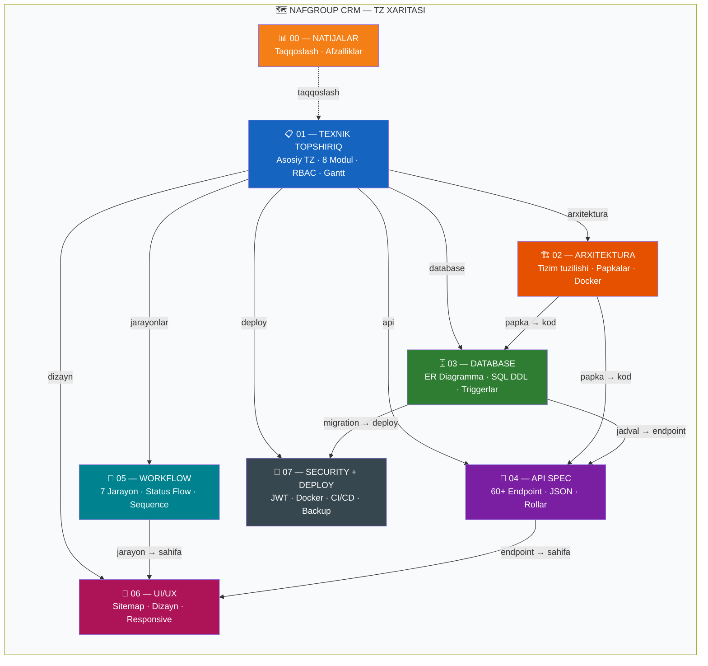
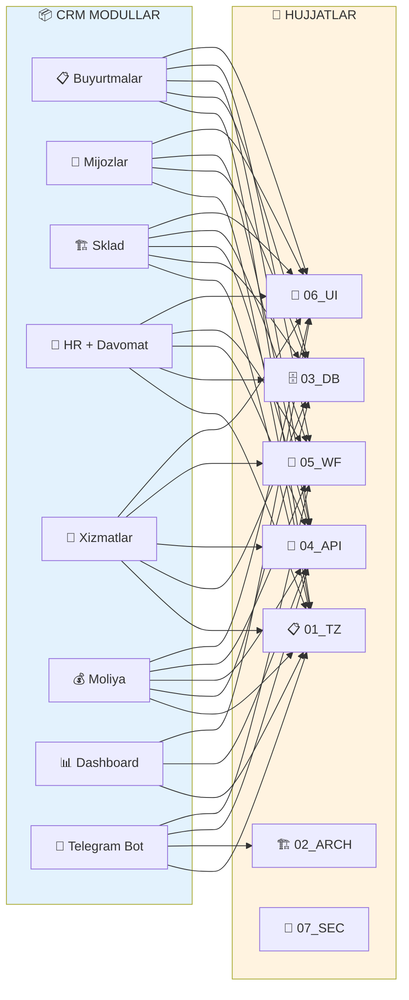
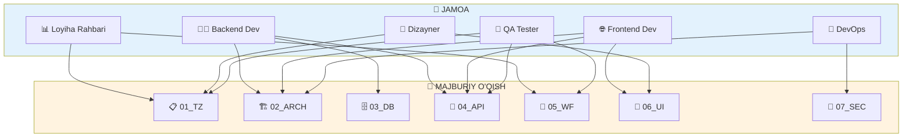
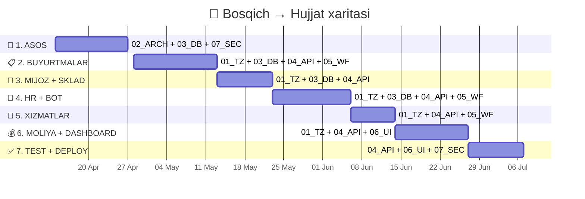
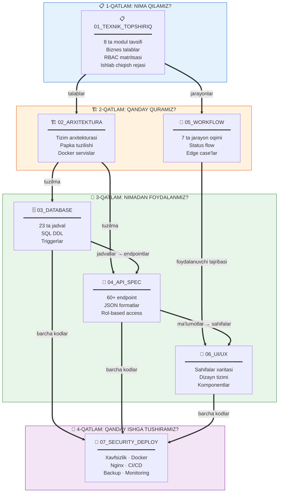

<![CDATA[<div align="center">

# 🗺 TZ XARITASI (TZ MAP)

### NafGroup CRM — Texnik Hujjatlar Navigatsiyasi

---

*Barcha hujjatlar orasidagi aloqalar va tuzilma*

</div>

<br/>

---

## 🌐 1. UMUMIY XARITA



---

<br/>

## 📂 2. HUJJATLAR TUZILISHI

```
📁 NafGroupCrm/docs/
│
├── 📊 00_NATIJALAR_VA_TAQQOSLASH.md    ← v1.0 vs v2.0 taqqoslash
│
├── 📋 01_TEXNIK_TOPSHIRIQ.md           ← ASOSIY HUJJAT (boshlanish nuqtasi)
│   │
│   ├──→ 🏗 02_ARXITEKTURA.md           ← Tizim qanday qurilgan?
│   │       ├── Backend papka tuzilishi
│   │       ├── Frontend papka tuzilishi
│   │       └── Docker servislar
│   │
│   ├──→ 🗄 03_DATABASE_SCHEMA.md       ← Qanday jadvallar bor?
│   │       ├── ER diagramma (vizual)
│   │       ├── SQL DDL (kod)
│   │       └── Triggerlar + Indekslar
│   │
│   ├──→ 🔌 04_API_SPECIFICATION.md     ← Qanday API endpoint'lar?
│   │       ├── Auth, Orders, Clients...
│   │       ├── Request/Response JSON
│   │       └── Rol-based access
│   │
│   ├──→ 🔄 05_WORKFLOW_DIAGRAMS.md     ← Jarayonlar qanday ishlaydi?
│   │       ├── Buyurtma hayot sikli
│   │       ├── Sklad kirim-chiqim
│   │       ├── HR davomat
│   │       ├── Ish haqi hisoblash
│   │       ├── Xizmat zakazi
│   │       ├── To'lov boshqaruvi
│   │       └── Login navigatsiya
│   │
│   ├──→ 🎨 06_UI_UX_DESIGN.md          ← Qanday ko'rinishi kerak?
│   │       ├── Sahifalar xaritasi
│   │       ├── Layout wireframe
│   │       ├── Ranglar + Tipografiya
│   │       ├── Komponentlar
│   │       └── Animatsiyalar
│   │
│   └──→ 🔐 07_SECURITY_DEPLOY.md       ← Qanday deploy qilinadi?
│           ├── Xavfsizlik choralari
│           ├── Docker Compose
│           ├── Nginx konfiguratsiya
│           ├── CI/CD pipeline
│           ├── Backup strategiya
│           └── Environment variables
│
└── 🗺 08_TZ_MAP.md                     ← SIZ HOZIR SHU YERDASZ
```

---

<br/>

## 🔗 3. MODULLAR → HUJJATLAR BOG'LIQLIGI

> Har bir CRM moduli qaysi hujjatlarda tasvirlangan?



| Modul | 01 TZ | 02 Arch | 03 DB | 04 API | 05 WF | 06 UI | 07 Sec |
|:------|:-----:|:-------:|:-----:|:------:|:-----:|:-----:|:------:|
| 📋 **Buyurtmalar** | ✅ | — | ✅ | ✅ | ✅ | ✅ | — |
| 👥 **Mijozlar** | ✅ | — | ✅ | ✅ | — | ✅ | — |
| 🏗 **Sklad** | ✅ | — | ✅ | ✅ | ✅ | ✅ | — |
| 👷 **HR** | ✅ | — | ✅ | ✅ | ✅ | ✅ | — |
| 🔧 **Xizmatlar** | ✅ | — | ✅ | ✅ | ✅ | ✅ | — |
| 💰 **Moliya** | ✅ | — | ✅ | ✅ | ✅ | ✅ | — |
| 📊 **Dashboard** | ✅ | — | — | ✅ | — | ✅ | — |
| 🤖 **Telegram Bot** | ✅ | ✅ | — | ✅ | ✅ | — | — |
| 🔑 **Auth / RBAC** | ✅ | ✅ | ✅ | ✅ | ✅ | — | ✅ |
| 🐳 **Deploy** | — | ✅ | — | — | — | — | ✅ |

---

<br/>

## 👤 4. ROLLAR → HUJJATLAR

> Har bir jamoa a'zosi qaysi hujjatlarni o'qishi kerak?



| Rol | Asosiy hujjatlar | Qo'shimcha |
|:----|:-----------------|:-----------|
| 📊 **Loyiha rahbari** | `01_TZ` · `05_WORKFLOW` | `00_NATIJALAR` |
| 👨‍💻 **Backend dev** | `02_ARCH` · `03_DB` · `04_API` | `05_WORKFLOW` |
| 🌐 **Frontend dev** | `02_ARCH` · `04_API` · `06_UI` | `05_WORKFLOW` |
| 🎨 **Dizayner** | `01_TZ` · `06_UI` | `05_WORKFLOW` |
| 🔧 **DevOps** | `02_ARCH` · `07_SECURITY` | — |
| 🧪 **QA Tester** | `01_TZ` · `04_API` · `05_WORKFLOW` | `06_UI` |

---

<br/>

## 📅 5. ISHLAB CHIQISH BOSQICHLARI → HUJJATLAR

> Qaysi bosqichda qaysi hujjatga murojaat qilinadi?



| # | Bosqich | Kerakli hujjatlar |
|:-:|:--------|:------------------|
| 1 | 📐 **Asos** (Docker, DB, Auth) | `02_ARCH` → `03_DB` → `07_SEC` |
| 2 | 📋 **Buyurtmalar** | `01_TZ §4` → `03_DB (orders)` → `04_API §2` → `05_WF §1` |
| 3 | 👥 **Mijoz + Sklad** | `01_TZ §6-7` → `03_DB (clients, products)` → `04_API §3-4` |
| 4 | 👷 **HR + Bot** | `01_TZ §5` → `03_DB (workers)` → `04_API §5` → `05_WF §3-4` |
| 5 | 🔧 **Xizmatlar** | `01_TZ §8` → `04_API §6` → `05_WF §5` |
| 6 | 💰 **Moliya + Dashboard** | `01_TZ §9-10` → `04_API §7-8` → `06_UI §4` |
| 7 | ✅ **Test + Deploy** | `04_API` → `06_UI` → `07_SEC` |

---

<br/>

## 📊 6. HUJJATLAR ORASIDAGI MA'LUMOT OQIMI



---

<div align="center">

### 🧭 QANDAY BOSHLASH KERAK?

```
1️⃣  01_TZ ni o'qing          → Tizim nima qilishini tushuning
2️⃣  02_ARCH ni o'qing         → Qanday qurilganini tushuning
3️⃣  O'z rolingizga mos        → hujjatni oching va ishlang!
```

---

*🗺 TZ Map yakunlandi*

`NafGroup CRM` · `TZ v2.0` · `2025`

</div>
]]>
