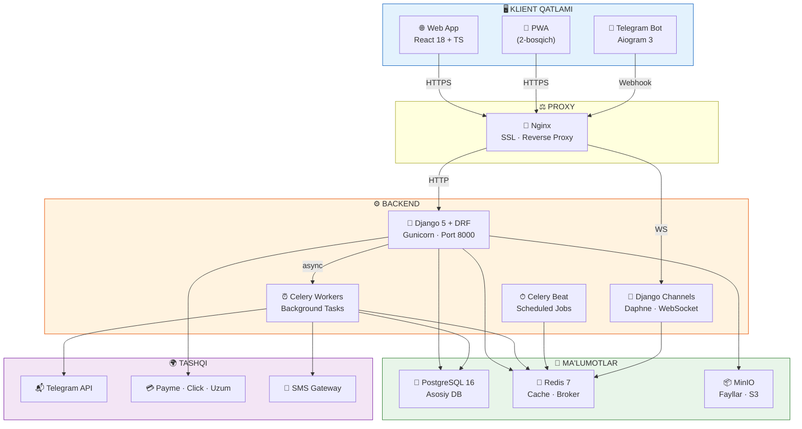
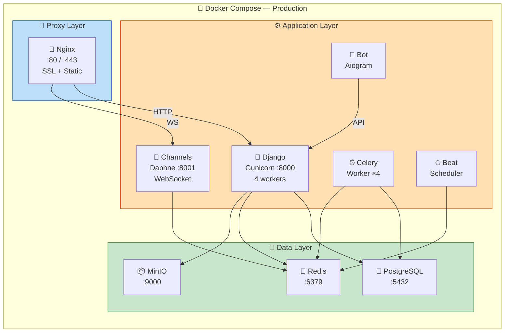
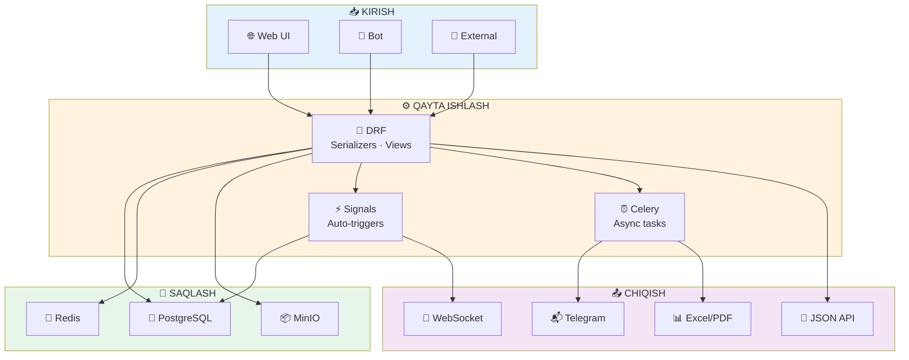

# 🏗 ARXITEKTURA DIAGRAMMALARI
### NafGroup CRM — Tizim Arxitekturasi

---

## 📐 1. YUQORI DARAJADAGI ARXITEKTURA



---

## 📂 2. BACKEND LOYIHA TUZILISHI

```
nafgroup_crm/
│
├── 📁 config/                        ⚙️ Django konfiguratsiya
│   ├── settings/
│   │   ├── base.py                   Umumiy sozlamalar
│   │   ├── development.py            Dev muhit
│   │   └── production.py             Production muhit
│   ├── urls.py                       Asosiy URL routing
│   ├── wsgi.py                       WSGI entry point
│   ├── asgi.py                       ASGI (WebSocket)
│   └── celery.py                     Celery sozlamalari
│
├── 📁 apps/                          📦 Django ilovalari
│   │
│   ├── 📁 accounts/                  🔑 Autentifikatsiya
│   ├── 📁 orders/                    📋 Buyurtmalar
│   ├── 📁 clients/                   👥 Mijozlar
│   ├── 📁 warehouse/                 🏗 Sklad
│   ├── 📁 staff/                     👷 Ishchilar HR
│   ├── 📁 services/                  🔧 Xizmatlar
│   ├── 📁 finance/                   💰 Moliya
│   ├── 📁 dashboard/                 📊 Dashboard
│   ├── 📁 bot/                       🤖 Telegram Bot
│   └── 📁 common/                    🔧 Umumiy utils
│
├── 📁 media/                          Yuklangan fayllar (dev)
├── 📁 static/                         Statik fayllar
├── 📁 templates/                      PDF shablonlari
│
├── 📁 docker/
│   ├── Dockerfile                    Django container
│   ├── Dockerfile.bot                Telegram bot container
│   └── nginx/
│       ├── nginx.conf                Nginx konfiguratsiya
│       └── ssl/                      SSL sertifikatlar
│
├── docker-compose.yml                Dev muhit
├── docker-compose.prod.yml           Production muhit
├── 📁 requirements/
├── manage.py
├── .env.example
└── README.md
```

---

## 🌐 3. FRONTEND LOYIHA TUZILISHI

```
frontend/
│
├── 📁 src/
│   │
│   ├── 📁 app/                       ⚛️ App yadro
│   │   ├── App.tsx
│   │   └── providers/
│   │
│   ├── 📁 pages/                     📄 Sahifalar
│   │   ├── auth/
│   │   ├── dashboard/
│   │   ├── orders/
│   │   ├── clients/
│   │   ├── warehouse/
│   │   ├── staff/
│   │   ├── services/
│   │   └── finance/
│   │
│   ├── 📁 components/                🧩 Umumiy komponentlar
│   │   ├── ui/                       Shadcn/UI
│   │   └── shared/
│   │
│   ├── 📁 hooks/                     🪝 Custom hooks
│   ├── 📁 stores/                    🗄 Zustand stores
│   ├── 📁 lib/                       📚 Yordamchilar (api, utils)
│   ├── 📁 styles/
│   └── main.tsx
│
├── public/
├── index.html
├── vite.config.ts
├── tailwind.config.ts
├── tsconfig.json
└── package.json
```

---

## 🐳 4. DOCKER DEPLOY ARXITEKTURASI



### 4.1 Servislar ro'yxati

| # | Servis | Image | Port | Vazifa |
|:-:|:-------|:------|:----:|:-------|
| 1 | 🐘 **postgres** | `postgres:16-alpine` | 5432 | Database |
| 2 | 🔴 **redis** | `redis:7-alpine` | 6379 | Cache + Broker |
| 3 | 📦 **minio** | `minio/minio` | 9000 | File storage |
| 4 | 🐍 **django** | Custom | 8000 | REST API |
| 5 | 🔌 **channels** | Custom | 8001 | WebSocket |
| 6 | ⏰ **celery** | Custom | — | Background tasks |
| 7 | ⏱ **celery-beat** | Custom | — | Scheduled tasks |
| 8 | 🤖 **bot** | Custom | — | Telegram bot |
| 9 | 📡 **nginx** | `nginx:alpine` | 80/443 | Reverse proxy |

---

## 🔄 5. MA'LUMOTLAR OQIMI



---

*📐 Arxitektura hujjati yakunlandi*
