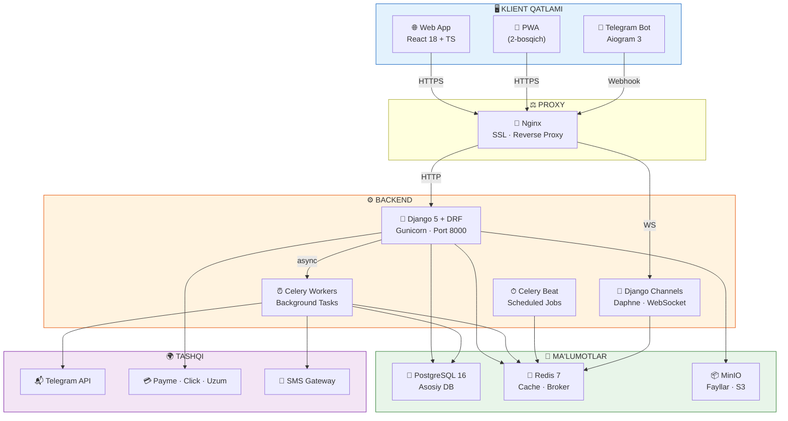
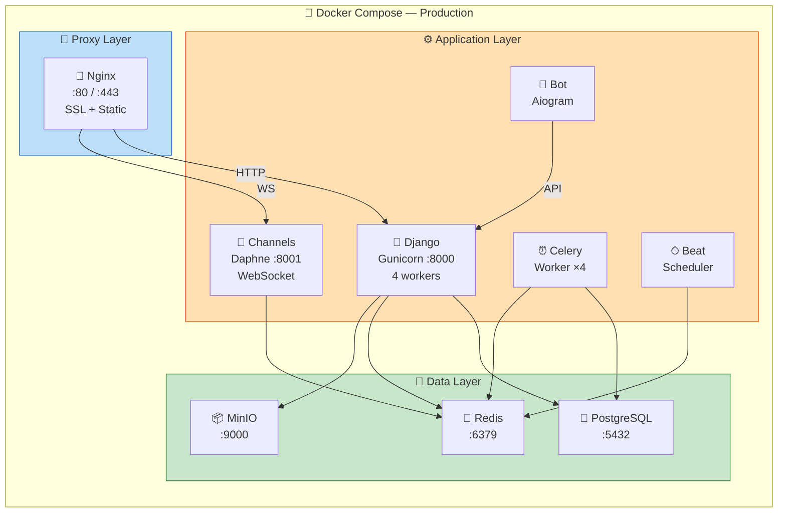
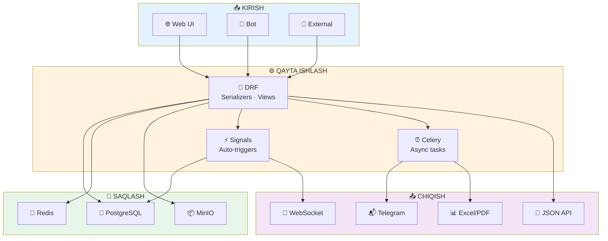

<![CDATA[<div align="center">

# 🏗 ARXITEKTURA DIAGRAMMALARI

### NafGroup CRM — Tizim Arxitekturasi

---

</div>

<br/>

## 📐 1. YUQORI DARAJADAGI ARXITEKTURA



---

<br/>

## 📂 2. BACKEND LOYIHA TUZILISHI

```
nafgroup_crm/
│
├── 📁 config/                        ⚙️ Django konfiguratsiya
│   ├── settings/
│   │   ├── base.py                   Umumiy sozlamalar
│   │   ├── development.py            Dev muhit
│   │   └── production.py             Production muhit
│   ├── urls.py                       Asosiy URL routing
│   ├── wsgi.py                       WSGI entry point
│   ├── asgi.py                       ASGI (WebSocket)
│   └── celery.py                     Celery sozlamalari
│
├── 📁 apps/                          📦 Django ilovalari
│   │
│   ├── 📁 accounts/                  🔑 Autentifikatsiya
│   │   ├── models.py                 User, Role
│   │   ├── serializers.py            Login/Register/Profile
│   │   ├── views.py                  Auth endpoints
│   │   ├── permissions.py            RBAC permissions
│   │   ├── urls.py
│   │   └── tests/
│   │
│   ├── 📁 orders/                    📋 Buyurtmalar
│   │   ├── models.py                 Order, OrderFile, StatusHistory
│   │   ├── serializers.py            CRUD + nested serializers
│   │   ├── views.py                  ViewSets + custom actions
│   │   ├── filters.py                Status/Priority/Date filters
│   │   ├── signals.py                Status change → sklad, notification
│   │   ├── tasks.py                  Async notifications
│   │   ├── urls.py
│   │   └── tests/
│   │
│   ├── 📁 clients/                   👥 Mijozlar
│   │   ├── models.py                 Client, Tag, Note, CallLog
│   │   ├── serializers.py
│   │   ├── views.py
│   │   ├── urls.py
│   │   └── tests/
│   │
│   ├── 📁 warehouse/                 🏗 Sklad
│   │   ├── models.py                 Product, Movement, Supplier
│   │   ├── serializers.py
│   │   ├── views.py
│   │   ├── signals.py                Auto stock update trigger
│   │   ├── urls.py
│   │   └── tests/
│   │
│   ├── 📁 staff/                     👷 Ishchilar HR
│   │   ├── models.py                 Worker, Attendance, Schedule
│   │   ├── serializers.py
│   │   ├── views.py
│   │   ├── tasks.py                  Salary calculation (Celery)
│   │   ├── urls.py
│   │   └── tests/
│   │
│   ├── 📁 services/                  🔧 Xizmatlar
│   │   ├── models.py                 ServiceOrder, Resource
│   │   ├── serializers.py
│   │   ├── views.py
│   │   ├── urls.py
│   │   └── tests/
│   │
│   ├── 📁 finance/                   💰 Moliya
│   │   ├── models.py                 Payment, Expense, CashFlow
│   │   ├── serializers.py
│   │   ├── views.py
│   │   ├── tasks.py                  Report generation (Celery)
│   │   ├── urls.py
│   │   └── tests/
│   │
│   ├── 📁 dashboard/                 📊 Dashboard
│   │   ├── views.py                  Stats aggregation endpoints
│   │   ├── serializers.py
│   │   ├── consumers.py              WebSocket consumers
│   │   └── urls.py
│   │
│   ├── 📁 bot/                       🤖 Telegram Bot
│   │   ├── handlers/
│   │   │   ├── start.py              /start + menyu
│   │   │   ├── attendance.py         KELDIM / KETDIM
│   │   │   ├── reports.py            STATISTIKA
│   │   │   └── admin.py              Boshliq buyruqlari
│   │   ├── keyboards.py              Inline/Reply keyboards
│   │   ├── messages.py               Xabar shablonlari
│   │   ├── webhook.py                Webhook endpoint
│   │   └── bot.py                    Bot instance
│   │
│   └── 📁 common/                    🔧 Umumiy
│       ├── mixins.py                 Audit, Timestamp mixins
│       ├── permissions.py            Global permissions
│       ├── pagination.py             Custom pagination
│       ├── utils.py                  Helper functions
│       └── export.py                 Excel/PDF export utils
│
├── 📁 media/                          Yuklangan fayllar (dev)
├── 📁 static/                         Statik fayllar
├── 📁 templates/                      PDF shablonlari
│
├── 📁 docker/
│   ├── Dockerfile                    Django container
│   ├── Dockerfile.bot                Telegram bot container
│   └── nginx/
│       ├── nginx.conf                Nginx konfiguratsiya
│       └── ssl/                      SSL sertifikatlar
│
├── docker-compose.yml                Dev muhit
├── docker-compose.prod.yml           Production muhit
├── 📁 requirements/
│   ├── base.txt
│   ├── development.txt
│   └── production.txt
├── manage.py
├── .env.example
└── README.md
```

---

<br/>

## 🌐 3. FRONTEND LOYIHA TUZILISHI

```
frontend/
│
├── 📁 src/
│   │
│   ├── 📁 app/                       ⚛️ App yadro
│   │   ├── App.tsx                   Root component
│   │   ├── Router.tsx                Route definitions
│   │   └── providers/
│   │       ├── AuthProvider.tsx       JWT context
│   │       ├── ThemeProvider.tsx      Dark/Light
│   │       └── QueryProvider.tsx      TanStack Query
│   │
│   ├── 📁 pages/                     📄 Sahifalar
│   │   ├── auth/
│   │   │   └── LoginPage.tsx
│   │   ├── dashboard/
│   │   │   ├── DashboardPage.tsx
│   │   │   └── components/
│   │   │       ├── StatsCards.tsx
│   │   │       ├── OrdersKanban.tsx
│   │   │       ├── RevenueChart.tsx
│   │   │       ├── StockAlerts.tsx
│   │   │       └── StaffStatus.tsx
│   │   ├── orders/
│   │   │   ├── OrdersListPage.tsx
│   │   │   ├── OrderDetailPage.tsx
│   │   │   ├── OrderCreatePage.tsx
│   │   │   └── components/
│   │   │       ├── OrderTable.tsx
│   │   │       ├── OrderForm.tsx
│   │   │       ├── OrderKanban.tsx
│   │   │       ├── StatusBadge.tsx
│   │   │       ├── FileUploader.tsx
│   │   │       └── QueueManager.tsx
│   │   ├── clients/
│   │   │   ├── ClientsListPage.tsx
│   │   │   ├── ClientDetailPage.tsx
│   │   │   └── components/...
│   │   ├── warehouse/
│   │   │   ├── WarehousePage.tsx
│   │   │   └── components/...
│   │   ├── staff/
│   │   │   ├── StaffListPage.tsx
│   │   │   └── components/...
│   │   ├── services/
│   │   │   ├── ServicesListPage.tsx
│   │   │   └── components/...
│   │   ├── finance/
│   │   │   ├── FinancePage.tsx
│   │   │   └── components/...
│   │   ├── reports/
│   │   │   └── ReportsPage.tsx
│   │   └── settings/
│   │       └── SettingsPage.tsx
│   │
│   ├── 📁 components/                🧩 Umumiy komponentlar
│   │   ├── ui/                       Shadcn/UI
│   │   └── shared/
│   │       ├── Sidebar.tsx
│   │       ├── Header.tsx
│   │       ├── DataTable.tsx
│   │       ├── FileUpload.tsx
│   │       ├── SearchInput.tsx
│   │       └── ConfirmDialog.tsx
│   │
│   ├── 📁 hooks/                     🪝 Custom hooks
│   │   ├── useAuth.ts
│   │   ├── useApi.ts
│   │   ├── useOrders.ts
│   │   ├── useClients.ts
│   │   └── useWebSocket.ts
│   │
│   ├── 📁 stores/                    🗄 Zustand stores
│   │   ├── authStore.ts
│   │   ├── uiStore.ts
│   │   └── notificationStore.ts
│   │
│   ├── 📁 lib/                       📚 Yordamchilar
│   │   ├── api.ts                    Axios instance
│   │   ├── constants.ts
│   │   ├── types.ts                  TypeScript turlari
│   │   ├── utils.ts
│   │   └── validators.ts            Zod schemas
│   │
│   ├── 📁 styles/
│   │   └── globals.css
│   └── main.tsx
│
├── public/
├── index.html
├── vite.config.ts
├── tailwind.config.ts
├── tsconfig.json
└── package.json
```

---

<br/>

## 🐳 4. DOCKER DEPLOY ARXITEKTURASI



### 4.1 Servislar ro'yxati

| # | Servis | Image | Port | Vazifa |
|:-:|:-------|:------|:----:|:-------|
| 1 | 🐘 **postgres** | `postgres:16-alpine` | 5432 | Database |
| 2 | 🔴 **redis** | `redis:7-alpine` | 6379 | Cache + Broker |
| 3 | 📦 **minio** | `minio/minio` | 9000 | File storage |
| 4 | 🐍 **django** | Custom | 8000 | REST API |
| 5 | 🔌 **channels** | Custom | 8001 | WebSocket |
| 6 | ⏰ **celery** | Custom | — | Background tasks |
| 7 | ⏱ **celery-beat** | Custom | — | Scheduled tasks |
| 8 | 🤖 **bot** | Custom | — | Telegram bot |
| 9 | 📡 **nginx** | `nginx:alpine` | 80/443 | Reverse proxy |

---

<br/>

## 🔄 5. MA'LUMOTLAR OQIMI



---

<div align="center">

*📐 Arxitektura hujjati yakunlandi*

</div>
]]>
