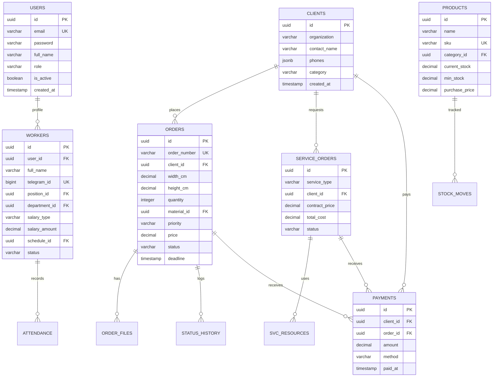
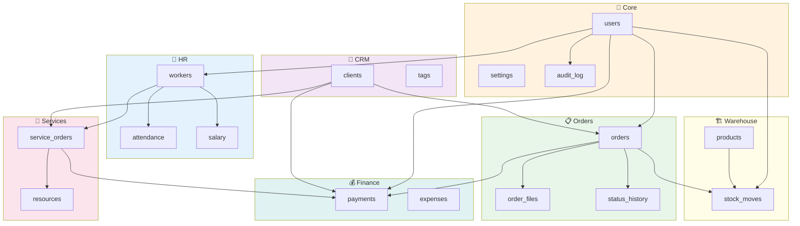

# 🗄 MA'LUMOTLAR BAZASI SXEMASI
### NafGroup CRM — PostgreSQL Database Schema

---

## 📊 1. ER DIAGRAMMA



---

## 📋 2. JADVALLAR RO'YXATI

| # | Jadval | Modul | Tavsif |
|:-:|:-------|:-----:|:-------|
| 1 | `users` | 🔑 Core | Foydalanuvchilar va autentifikatsiya |
| 2 | `workers` | 👷 HR | Ishchilar profili |
| 3 | `departments` | 👷 HR | Bo'limlar |
| 4 | `positions` | 👷 HR | Lavozimlar |
| 5 | `schedules` | 👷 HR | Ish jadvallari |
| 6 | `attendance_logs` | 👷 HR | Keldi-ketdi jurnali |
| 7 | `salary_records` | 👷 HR | Oylik ish haqi |
| 8 | `clients` | 👥 CRM | Mijozlar |
| 9 | `client_tags` | 👥 CRM | Teglar |
| 10 | `orders` | 📋 Orders | Buyurtmalar |
| 11 | `order_files` | 📋 Orders | Buyurtma fayllari |
| 12 | `order_status_history` | 📋 Orders | Holat tarixi |
| 13 | `products` | 🏗 Sklad | Mahsulotlar |
| 14 | `product_categories` | 🏗 Sklad | Kategoriyalar |
| 15 | `suppliers` | 🏗 Sklad | Yetkazib beruvchilar |
| 16 | `stock_movements` | 🏗 Sklad | Kirim/chiqim harakatlari |
| 17 | `service_orders` | 🔧 Xizmat | Xizmat zakazlari |
| 18 | `service_resources` | 🔧 Xizmat | Xizmat resurslari |
| 19 | `payments` | 💰 Moliya | To'lovlar |
| 20 | `expenses` | 💰 Moliya | Xarajatlar |
| 21 | `expense_categories` | 💰 Moliya | Xarajat toifalari |
| 22 | `audit_log` | 📝 Core | Amallar logi |
| 23 | `settings` | ⚙️ Core | Tizim sozlamalari |

---

## 🔨 3. SQL DDL — ASOSIY JADVALLAR

### 3.1 🔑 `users`

```sql
CREATE TABLE users (
    id          UUID PRIMARY KEY DEFAULT gen_random_uuid(),
    email       VARCHAR(255) UNIQUE NOT NULL,
    password    VARCHAR(255) NOT NULL,
    full_name   VARCHAR(255) NOT NULL,
    phone       VARCHAR(20),
    role        VARCHAR(20) NOT NULL DEFAULT 'WORKER',
    -- Roles: SUPERADMIN | DIRECTOR | MANAGER | OPERATOR
    --        WAREHOUSE_MANAGER | ACCOUNTANT | WORKER
    is_active   BOOLEAN DEFAULT TRUE,
    last_login  TIMESTAMPTZ,
    created_at  TIMESTAMPTZ DEFAULT NOW(),
    updated_at  TIMESTAMPTZ DEFAULT NOW()
);

CREATE INDEX idx_users_email ON users(email);
CREATE INDEX idx_users_role ON users(role);
```

---

### 3.2 👷 `workers`

```sql
CREATE TABLE workers (
    id                UUID PRIMARY KEY DEFAULT gen_random_uuid(),
    user_id           UUID REFERENCES users(id) ON DELETE CASCADE,
    full_name         VARCHAR(255) NOT NULL,
    phone             VARCHAR(20) NOT NULL,
    telegram_id       BIGINT UNIQUE,
    telegram_username VARCHAR(100),
    position_id       UUID REFERENCES positions(id),
    department_id     UUID REFERENCES departments(id),
    hire_date         DATE NOT NULL,
    salary_type       VARCHAR(10) NOT NULL,  -- MONTHLY | HOURLY | DAILY
    salary_amount     DECIMAL(15,2) NOT NULL,
    schedule_id       UUID REFERENCES schedules(id),
    bank_details      TEXT,
    status            VARCHAR(20) DEFAULT 'ACTIVE',
    -- ACTIVE | ON_LEAVE | SICK | DISMISSED
    photo             VARCHAR(500),
    created_at        TIMESTAMPTZ DEFAULT NOW(),
    updated_at        TIMESTAMPTZ DEFAULT NOW()
);

CREATE INDEX idx_workers_telegram ON workers(telegram_id);
CREATE INDEX idx_workers_status ON workers(status);
```

---

### 3.3 📋 `orders`

```sql
CREATE TABLE orders (
    id               UUID PRIMARY KEY DEFAULT gen_random_uuid(),
    order_number     VARCHAR(30) UNIQUE NOT NULL,  -- ORD-20250402-001
    client_id        UUID NOT NULL REFERENCES clients(id),
    width_cm         DECIMAL(10,2) NOT NULL,
    height_cm        DECIMAL(10,2) NOT NULL,
    measurement_unit VARCHAR(5) DEFAULT 'cm',      -- mm | cm | m
    quantity         INTEGER NOT NULL DEFAULT 1,
    material_id      UUID REFERENCES products(id),
    print_type       VARCHAR(20) DEFAULT 'ONE_SIDE', -- ONE_SIDE | TWO_SIDE
    submitted_at     TIMESTAMPTZ DEFAULT NOW(),
    deadline         TIMESTAMPTZ NOT NULL,
    priority         VARCHAR(15) DEFAULT 'NORMAL', -- NORMAL | URGENT | RUSH
    queue_position   INTEGER,
    price            DECIMAL(15,2) NOT NULL,
    material_cost    DECIMAL(15,2) DEFAULT 0,
    notes            TEXT,
    status           VARCHAR(20) DEFAULT 'NEW',
    -- NEW | PREPARING | PRINTING | LAMINATING | CUTTING
    -- READY | DELIVERED | PAID | CANCELLED
    created_by       UUID REFERENCES users(id),
    assigned_to      UUID REFERENCES users(id),
    created_at       TIMESTAMPTZ DEFAULT NOW(),
    updated_at       TIMESTAMPTZ DEFAULT NOW()
);

CREATE INDEX idx_orders_status   ON orders(status);
CREATE INDEX idx_orders_client   ON orders(client_id);
CREATE INDEX idx_orders_deadline ON orders(deadline);
CREATE INDEX idx_orders_priority ON orders(priority);
CREATE INDEX idx_orders_queue    ON orders(queue_position);
CREATE INDEX idx_orders_created  ON orders(created_at DESC);
```

---

### 3.4 👥 `clients`

```sql
CREATE TABLE clients (
    id                UUID PRIMARY KEY DEFAULT gen_random_uuid(),
    organization_name VARCHAR(255),
    contact_name      VARCHAR(255) NOT NULL,
    contact_position  VARCHAR(100),
    phone_numbers     JSONB NOT NULL DEFAULT '[]',
    email             VARCHAR(255),
    telegram          VARCHAR(100),
    tax_id            VARCHAR(20),       -- STIR
    requisites        TEXT,
    address           TEXT,
    category          VARCHAR(15) DEFAULT 'NEW',
    -- VIP | REGULAR | NEW | PROBLEM
    notes             TEXT,
    registered_at     DATE DEFAULT CURRENT_DATE,
    last_activity     DATE,
    created_at        TIMESTAMPTZ DEFAULT NOW(),
    updated_at        TIMESTAMPTZ DEFAULT NOW()
);

CREATE INDEX idx_clients_category ON clients(category);
CREATE INDEX idx_clients_name ON clients(contact_name);
```

---

### 3.5 🏗 `products` + `stock_movements`

```sql
CREATE TABLE products (
    id             UUID PRIMARY KEY DEFAULT gen_random_uuid(),
    name           VARCHAR(255) NOT NULL,
    sku            VARCHAR(50) UNIQUE NOT NULL,
    category_id    UUID REFERENCES product_categories(id),
    unit           VARCHAR(10) NOT NULL,  -- m2 | piece | kg | meter | liter | roll
    current_stock  DECIMAL(15,3) DEFAULT 0,
    min_stock      DECIMAL(15,3) DEFAULT 0,
    purchase_price DECIMAL(15,2) DEFAULT 0,
    selling_price  DECIMAL(15,2) DEFAULT 0,
    supplier_id    UUID REFERENCES suppliers(id),
    location       VARCHAR(100),
    is_active      BOOLEAN DEFAULT TRUE,
    created_at     TIMESTAMPTZ DEFAULT NOW()
);

CREATE TABLE stock_movements (
    id               UUID PRIMARY KEY DEFAULT gen_random_uuid(),
    product_id       UUID NOT NULL REFERENCES products(id),
    movement_type    VARCHAR(15) NOT NULL,
    -- INCOME | ORDER_EXPENSE | SERVICE_EXPENSE | MANUAL_EXPENSE | RETURN
    quantity         DECIMAL(15,3) NOT NULL,
    unit_price       DECIMAL(15,2),
    total_amount     DECIMAL(15,2),
    order_id         UUID REFERENCES orders(id),
    service_order_id UUID REFERENCES service_orders(id),
    supplier_id      UUID REFERENCES suppliers(id),
    document_number  VARCHAR(50),
    document_file    VARCHAR(500),
    reason           TEXT,
    performed_by     UUID NOT NULL REFERENCES users(id),
    performed_at     TIMESTAMPTZ DEFAULT NOW()
);

CREATE INDEX idx_stock_product ON stock_movements(product_id);
CREATE INDEX idx_stock_date    ON stock_movements(performed_at DESC);
```

---

### 3.6 💰 `payments`

```sql
CREATE TABLE payments (
    id               UUID PRIMARY KEY DEFAULT gen_random_uuid(),
    payment_number   VARCHAR(30) UNIQUE NOT NULL,  -- PAY-20250402-001
    order_id         UUID REFERENCES orders(id),
    service_order_id UUID REFERENCES service_orders(id),
    client_id        UUID NOT NULL REFERENCES clients(id),
    amount           DECIMAL(15,2) NOT NULL,
    payment_method   VARCHAR(20) NOT NULL,
    -- CASH | BANK_TRANSFER | CARD | PAYME | CLICK | UZUM
    receipt_number   VARCHAR(50),
    receipt_file     VARCHAR(500),
    notes            TEXT,
    received_by      UUID REFERENCES users(id),
    paid_at          TIMESTAMPTZ DEFAULT NOW()
);

CREATE INDEX idx_payments_date   ON payments(paid_at DESC);
CREATE INDEX idx_payments_client ON payments(client_id);
```

---

## ⚡ 4. TRIGGER — SKLAD AVTOMATIK YANGILANISH

```sql
CREATE OR REPLACE FUNCTION update_stock()
RETURNS TRIGGER AS $$
BEGIN
    IF NEW.movement_type IN ('INCOME', 'RETURN') THEN
        UPDATE products 
        SET current_stock = current_stock + NEW.quantity,
            updated_at = NOW()
        WHERE id = NEW.product_id;
    ELSE
        UPDATE products 
        SET current_stock = current_stock - NEW.quantity,
            updated_at = NOW()
        WHERE id = NEW.product_id;
    END IF;
    RETURN NEW;
END;
$$ LANGUAGE plpgsql;

CREATE TRIGGER trg_stock_movement
AFTER INSERT ON stock_movements
FOR EACH ROW EXECUTE FUNCTION update_stock();
```

---

## 🔗 5. BOG'LIQLIKLAR DIAGRAMMASI



---

*🗄 Ma'lumotlar bazasi sxemasi yakunlandi*
