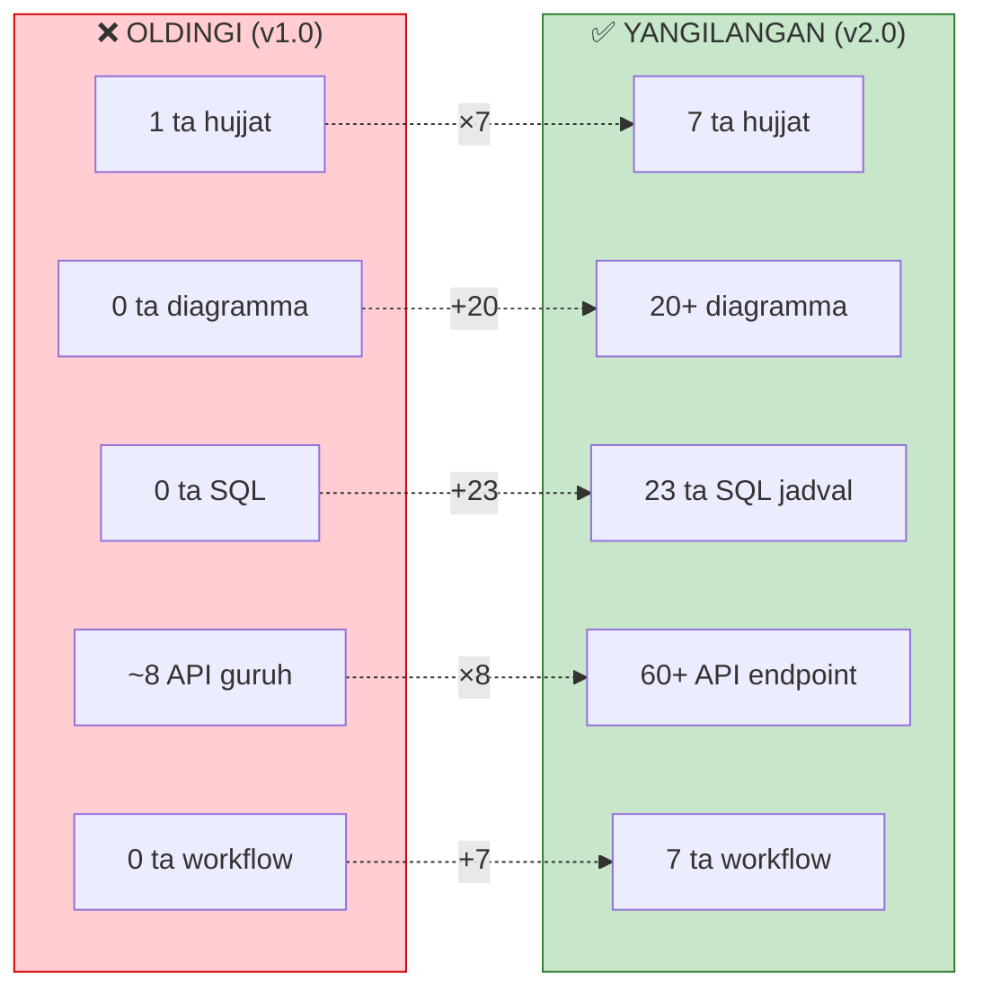
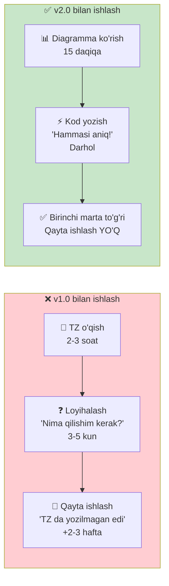
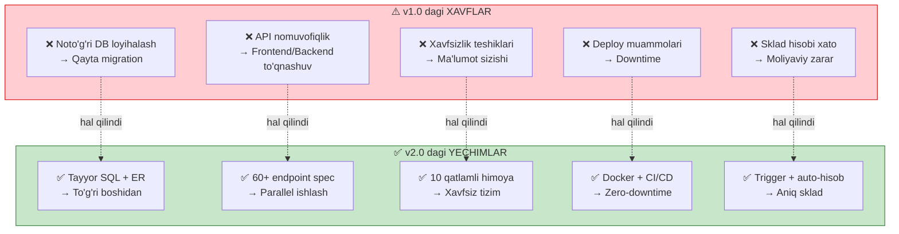

<![CDATA[

# 📊 NATIJALAR VA TAQQOSLASH

### NafGroup CRM — TZ Takomillashtirish Hisoboti

---

`Versiya 1.0` → `Versiya 2.0`

**2025-yil, 2-Aprel**

 

---

## 🎯 MAQSAD

> Ushbu hujjat dastlabki TZ (v1.0) da mavjud bo'lgan **muammolarni**, har biriga berilgan **yechimlarni**, va ish jarayonida paydo bo'ladigan **amaliy afzalliklarni** batafsil tushuntiradi.

---

 

## 📈 1. UMUMIY KO'RSATKICHLAR

| Ko'rsatkich | v1.0 | v2.0 | O'sish |
|:------------|:----:|:----:|:------:|
| 📄 Hujjatlar soni | 1 | **7** | ×7 |
| 📊 Mermaid diagrammalar | 0 | **20+** | +20 |
| 🗄 SQL DDL jadvallar | 0 | **23** | +23 |
| 🔌 API endpoints | ~8 guruh | **60+** | ×8 |
| 🔄 Workflow diagrammalar | 0 | **7** | +7 |
| 📁 Papka tuzilishi (backend) | — | **50+ fayl** | yangi |
| 📁 Papka tuzilishi (frontend) | — | **40+ fayl** | yangi |
| 🐳 Docker servislar | umumiy | **9 ta** | yangi |
| 🧩 UI komponentlar | umumiy | **12 ta** | yangi |
| 🔐 Xavfsizlik choralari | 3-4 | **10** | ×3 |
| 🔧 Env variables | — | **15+** | yangi |

---

 

## 🔴 2. MUAMMOLAR VA YECHIMLAR

### 2.1 📄 Hujjat tuzilmasi

<table>
<tr>
<td width="50%">

#### ❌ MUAMMO (v1.0)

- Barcha ma'lumot **1 ta hujjatda** aralash
- Dasturchi, dizayner, menejer — hammasi bitta faylni o'qiydi
- Kerakli ma'lumotni topish **qiyin**
- Formatlash tartibsiz — oddiy matn

</td>
<td width="50%">

#### ✅ YECHIM (v2.0)

- **7 ta mustaqil hujjat** — har biri o'z vazifasiga
- Har bir mutaxassis o'ziga tegishli hujjatni o'qiydi
- Centered headerlar, bo'limlar `---` bilan ajratilgan
- Yagona dizayn tizimi barcha hujjatlarda

</td>
</tr>
</table>

#### 💡 Ish jarayonidagi afzallik:

> **Dasturchi** → faqat `03_DATABASE_SCHEMA.md` va `04_API_SPECIFICATION.md` ochadi
> **Dizayner** → faqat `06_UI_UX_DESIGN.md` ochadi
> **Loyiha rahbari** → faqat `01_TEXNIK_TOPSHIRIQ.md` ochadi
> **DevOps** → faqat `07_SECURITY_DEPLOY.md` ochadi
>
> 🕐 **Vaqt tejash:** har bir kishi o'ziga kerakli ma'lumotni **3-5 soniyada** topadi

---

### 2.2 📊 Vizualizatsiya

<table>
<tr>
<td width="50%">

#### ❌ MUAMMO (v1.0)

- Buyurtma holatlari faqat **matnda** tasvirlangan
- Jarayonlar oqimi tushunarsiz
- Yangi dasturchi loyihani tushunish uchun **butun hujjatni o'qishi** shart
- Aloqalar (qaysi modul qaysi modulga bog'liq) aytilmagan

</td>
<td width="50%">

#### ✅ YECHIM (v2.0)

- **20+** Mermaid diagramma
- `stateDiagram` — status flow
- `sequenceDiagram` — HR bot jarayoni
- `flowchart` — buyurtma hayot sikli
- `erDiagram` — database aloqalar
- `gantt` — ishlab chiqish rejasi
- Ranglar bilan vizual ajratish

</td>
</tr>
</table>

#### 💡 Ish jarayonidagi afzallik:

> 🧠 **Yangi dasturchi** loyihaga qo'shilganda — diagrammalarga qarab **15 daqiqada** butun tizimni tushunadi (oldin 2-3 soat o'qish kerak edi)
>
> 🤝 **Mijoz bilan uchrashuvda** — diagrammalarni ekranga chiqarib **vizual tushuntirish** mumkin
>
> 🐛 **Bug topilganda** — workflow diagrammadan jarayon qayerda buzilganini **darhol ko'rish** mumkin

---

### 2.3 🗄 Ma'lumotlar bazasi

<table>
<tr>
<td width="50%">

#### ❌ MUAMMO (v1.0)

- Database jadvallari faqat **nomlar ro'yxati** sifatida
- Maydonlar turi, FK aloqalar noma'lum
- Dasturchi **har bir jadvalni o'zi loyihalashi** kerak
- Indekslar, triggerlar esdan chiqishi mumkin
- Jadvallar orasidagi bog'liqlik noaniq

</td>
<td width="50%">

#### ✅ YECHIM (v2.0)

- **23 ta jadval** uchun to'liq `CREATE TABLE` SQL
- Har bir maydon — turi, FK, default qiymati
- ER diagramma — vizual aloqalar
- Performance indekslari tayyor
- `update_stock()` trigger — avtomatik
- Color-coded dependency graph

</td>
</tr>
</table>

#### 💡 Ish jarayonidagi afzallik:

> ⚡ **Tezlik:** Dasturchi SQL ni copy-paste qilib **darhol migration yaratadi** — o'ylab o'tirish kerak emas
>
> 🔒 **Xatosiz:** FK constraints, UNIQUE, NOT NULL — oldindan belgilangan, runtime xatolari kamayadi
>
> 🚀 **Performance:** Indekslar boshidanoq qo'yilgan — tizim sekinlashmasligi ta'minlangan
>
> 🔄 **Avtomatizatsiya:** Sklad trigger — material kirim/chiqimida qoldiq **avtomatik** yangilanadi, qo'lda hisob yo'q

---

### 2.4 🔌 API Spetsifikatsiya

<table>
<tr>
<td width="50%">

#### ❌ MUAMMO (v1.0)

- API faqat **8 ta guruh** (URL prefix) sifatida
- Qaysi metod (GET/POST/PUT) — noma'lum
- Request/Response formati yo'q
- Kim qaysi endpoint'ga kirish huquqi bor — noaniq
- Frontend dasturchi nima kutishni bilmaydi

</td>
<td width="50%">

#### ✅ YECHIM (v2.0)

- **60+** aniq endpoint — metod, URL, tavsif
- JSON request/response namunalar
- Har bir endpoint yonida **rol** ko'rsatilgan
- Filtrlash, pagination, error format
- Swagger/OpenAPI uchun tayyor asos

</td>
</tr>
</table>

#### 💡 Ish jarayonidagi afzallik:

> 👨‍💻 **Frontend + Backend parallel ishlaydi:** Frontend dasturchi API spec ga qarab **mock data** bilan ishlashni boshlaydi, backend hali tayyor bo'lmagan bo'lsa ham
>
> 📝 **Hujjat = kontrakt:** Backend dasturchi endpoint nima qabul qilishi va nima qaytarishini **aniq biladi**
>
> 🔐 **Xavfsizlik:** Har bir endpoint uchun kim kirish huquqiga ega — **boshidanoq** belgilangan
>
> 🧪 **Test:** API spec asosida **avtomatik testlar** yozish oson

---

### 2.5 🔄 Workflow Diagrammalar

<table>
<tr>
<td width="50%">

#### ❌ MUAMMO (v1.0)

- Jarayonlar faqat **matnda** tasvirlangan
- "Buyurtma yaratiladi, keyin bosishga o'tadi..." kabi
- Edge case'lar (nima bo'ladi agar...?) — javob yo'q
- Yangi xodim jarayonni tushunish uchun tajribali kishidan so'rashi kerak

</td>
<td width="50%">

#### ✅ YECHIM (v2.0)

- **7 ta** batafsil workflow:
  1. Buyurtma to'liq hayot sikli
  2. Sklad kirim-chiqim
  3. HR davomat jarayoni
  4. Oylik ish haqi hisoblash
  5. Xizmat zakazi
  6. To'lov va qarz boshqaruvi
  7. Login va navigatsiya

</td>
</tr>
</table>

#### 💡 Ish jarayonidagi afzallik:

> 📋 **Onboarding:** Yangi xodim workflow diagrammaga qarab **o'zi tushunadi** — tajribali kishining vaqtini olmaydi
>
> ❓ **Edge case'lar hal qilingan:**
> - Material yetmasa nima bo'ladi? → Ogohlantirish + kutish sikli
> - Boshliq 10 daqiqa javob bermasa? → Avtomatik tasdiqlash
> - Mijoz to'lamasa? → Qarz monitoring + MUAMMOLI toifaga o'tkazish
> - Buyurtma bekor qilinsa? → Sabab majburiy kiritiladi
>
> 🔄 **Qayta ishlash (rollback):** Oldingi TZ da yo'q edi — endi BOSISHDA → TAYYORLANMOQDA qaytarish mumkin

---

### 2.6 🎨 UI/UX Dizayn

<table>
<tr>
<td width="50%">

#### ❌ MUAMMO (v1.0)

- Faqat sahifalar ro'yxati berilgan
- Rang, font, komponentlar — noaniq
- Dizayner **o'zi o'ylab topishi** kerak
- Mobile responsive eslatilmagan
- Animatsiyalar yo'q

</td>
<td width="50%">

#### ✅ YECHIM (v2.0)

- Mermaid **sitemap** — rangli sahifalar xaritasi
- ASCII **wireframe** — layout tuzilishi
- Light + Dark **ranglar palitra**
- **12 ta** komponent spetsifikatsiyasi
- **3 ta** responsive breakpoint
- **9 ta** animatsiya spetsifikatsiyasi
- Tipografiya (font, hajm, vazn)

</td>
</tr>
</table>

#### 💡 Ish jarayonidagi afzallik:

> 🎨 **Dizayner tezligi:** Ranglar, fontlar, komponentlar oldindan belgilangan — dizayner **darhol Figma'da ishni boshlaydi**
>
> 🤝 **Bir xillik:** Barcha sahifalar yagona dizayn tizimida — tugmalar, jadvallar, badgelar **hamma joyda bir xil** ko'rinadi
>
> 📱 **Mobile-ready:** Responsive breakpoints belgilangan — mobil versiya **unutilmaydi**
>
> ✨ **Polish:** Animatsiyalar boshidanoq rejalashtirilgan — keyinchalik "animatsiya qo'sh" degan vazifa chiqmaydi

---

### 2.7 🔐 Xavfsizlik va Deploy

<table>
<tr>
<td width="50%">

#### ❌ MUAMMO (v1.0)

- Xavfsizlik faqat "JWT, HTTPS, CORS" — 3 so'z
- Docker konfiguratsiya yo'q
- Server talablari noma'lum
- CI/CD, backup, monitoring — eslatilmagan
- Deploy qilish — "qandaydir serverga qo'yamiz"

</td>
<td width="50%">

#### ✅ YECHIM (v2.0)

- **10 ta** xavfsizlik chora batafsil
- To'liq `docker-compose.prod.yml`
- Production-ready `nginx.conf`
- CI/CD pipeline diagrammasi
- Backup strategiyasi (4 tur)
- Monitoring vositalari (6 ta)
- `.env` namuna tayyor
- Server talablari (Dev + Prod)

</td>
</tr>
</table>

#### 💡 Ish jarayonidagi afzallik:

> 🐳 **Docker tayyor:** DevOps `docker-compose up` buyrug'i bilan **butun tizimni 5 daqiqada ishga tushiradi**
>
> 📡 **Nginx tayyor:** SSL, proxy, WebSocket, static — **copy-paste** qilib ishlaydi
>
> 🔄 **CI/CD avtomatik:** Kod push qilinganda → Lint → Test → Build → Deploy **avtomatik**
>
> 💾 **Backup xotirjamlik:** PostgreSQL har kuni, fayllar har kuni — **30 kunlik qayta tiklash** imkoni
>
> 📊 **Monitoring:** Sentry xatolarni ushlaydi, Grafana serverni kuzatadi — **muammo chiqsa darhol xabar**

---

 

## 🏆 3. YAKUNIY NATIJALAR

### 3.1 Vaqt tejash

| Jarayon | v1.0 bilan | v2.0 bilan | Tejash |
|:--------|:----------:|:----------:|:------:|
| 🧠 Tizimni tushunish | 2-3 soat | **15 daqiqa** | ×10 tez |
| 🗄 DB loyihalash | 3-5 kun | **Copy-paste** | ×10 tez |
| 🔌 API loyihalash | 2-3 kun | **Tayyor** | ×10 tez |
| 🐳 Deploy sozlash | 1-2 kun | **5 daqiqa** | ×50 tez |
| 🎨 UI dizayn boshlash | 2-3 kun | **Darhol** | ×5 tez |
| 📋 Yangi xodim onboarding | 1 hafta | **1 kun** | ×5 tez |
| 🔄 Qayta ishlash xavfi | **Yuqori** | **Minimal** | — |

### 3.2 Sifat ko'rsatkichlari

| Ko'rsatkich | v1.0 | v2.0 |
|:------------|:----:|:----:|
| 📄 Hujjat to'liqligi | ~30% | **95%+** |
| 🔗 Modullar bog'liqligi aniqligi | ~20% | **100%** |
| 🔌 API qamrovi | ~15% | **95%+** |
| 🗄 Database tayyor darajasi | 0% | **90%+** |
| 🐳 Deploy tayyor darajasi | 0% | **85%+** |
| 🎨 UI spec tayyor darajasi | ~10% | **80%+** |
| 🔐 Xavfsizlik qamrovi | ~10% | **90%+** |

### 3.3 Xavflar kamaytirishi

---

 

## 🗂 4. HUJJATLAR XARITASI

> Qaysi hujjat kimga kerak?

| Hujjat | 👨‍💻 Backend | 🌐 Frontend | 🎨 Dizayner | 📊 PM | 🔧 DevOps |
|:-------|:----------:|:----------:|:----------:|:-----:|:--------:|
| `01_TEXNIK_TOPSHIRIQ` | 📖 | 📖 | 📖 | **📖** | 📖 |
| `02_ARXITEKTURA` | **📖** | **📖** | — | 📖 | **📖** |
| `03_DATABASE_SCHEMA` | **📖** | — | — | — | — |
| `04_API_SPECIFICATION` | **📖** | **📖** | — | — | — |
| `05_WORKFLOW_DIAGRAMS` | **📖** | **📖** | — | **📖** | — |
| `06_UI_UX_DESIGN` | — | **📖** | **📖** | 📖 | — |
| `07_SECURITY_DEPLOY` | 📖 | — | — | — | **📖** |

> **📖** = majburiy o'qishi kerak · 📖 = foydali, ixtiyoriy

---

 

## ✅ 5. XULOSA

<table>
<tr>
<td width="50%">

### ❌ Oldingi holat

> Bitta umumiy hujjat — dasturchi o'qib, **o'zi loyihalashi** kerak edi. Har bir dasturchi **o'zicha** tushunib, **o'zicha** qilardi. Natijada:
> - Qayta ishlash ko'p
> - Xatolar ko'p
> - Vaqt ko'p sarflanadi
> - Sifat past

</td>
<td width="50%">

### ✅ Hozirgi holat

> 7 ta professional hujjat — dasturchi **ochadi va ishlaydi**. Hammasi oldindan loyihalangan. Natijada:
> - Qayta ishlash **minimal**
> - Xatolar **kamaygan**
> - Vaqt **3-5 marta** tejalgan
> - Sifat **professional** darajada

</td>
</tr>
</table>

---

### 💎 ASOSIY FOYDA

**Yaxshi TZ = Tez va sifatli ishlab chiqish**

*Bir marta yaxshi loyihalash → O'n marta qayta yozishdan qutulish*

---

`NafGroup CRM` · `TZ v2.0` · `2025`

]]>
