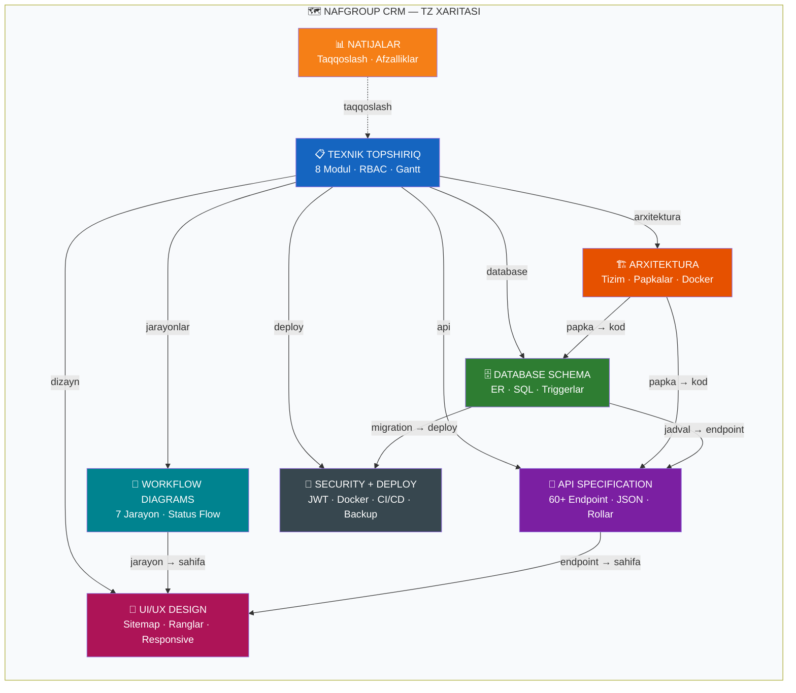
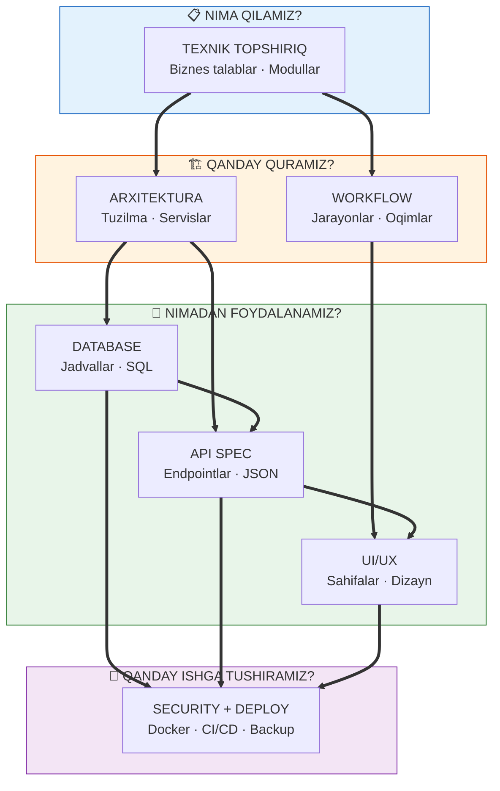

< | v1.0 vs v2.0 taqqoslash, afzalliklar, vaqt tejash |
| 📋 [TEXNIK_TOPSHIRIQ.md](file:///c:/Users/ZenBook/OneDrive/Рабочий%20стол/NafGroupCrm/docs/TEXNIK_TOPSHIRIQ.md) | Asosiy TZ — 8 modul, RBAC, status flow, Gantt |
| 🏗 [ARXITEKTURA.md](file:///c:/Users/ZenBook/OneDrive/Рабочий%20стол/NafGroupCrm/docs/ARXITEKTURA.md) | Tizim arxitekturasi, papka tuzilishi, Docker |
| 🗄 [DATABASE_SCHEMA.md](file:///c:/Users/ZenBook/OneDrive/Рабочий%20стол/NafGroupCrm/docs/DATABASE_SCHEMA.md) | ER diagramma, 23 ta jadval SQL, triggerlar |
| 🔌 [API_SPECIFICATION.md](file:///c:/Users/ZenBook/OneDrive/Рабочий%20стол/NafGroupCrm/docs/API_SPECIFICATION.md) | 60+ REST endpoint, JSON, rol-based access |
| 🔄 [WORKFLOW_DIAGRAMS.md](file:///c:/Users/ZenBook/OneDrive/Рабочий%20стол/NafGroupCrm/docs/WORKFLOW_DIAGRAMS.md) | 7 ta jarayon oqimi — buyurtma, HR, to'lov |
| 🎨 [UI_UX_DESIGN.md](file:///c:/Users/ZenBook/OneDrive/Рабочий%20стол/NafGroupCrm/docs/UI_UX_DESIGN.md) | Sahifalar xaritasi, dizayn tizimi, responsive |
| 🔐 [SECURITY_DEPLOY.md](file:///c:/Users/ZenBook/OneDrive/Рабочий%20стол/NafGroupCrm/docs/SECURITY_DEPLOY.md) | JWT, Docker Compose, Nginx, CI/CD, backup |
| 🗺 [TZ_MAP.md](file:///c:/Users/ZenBook/OneDrive/Рабочий%20стол/NafGroupCrm/docs/TZ_MAP.md) | Shu hujjat — navigatsiya xaritasi |

---

 

## 🌐 ALOQALAR XARITASI

---

 

## 👤 KIM NIMANI O'QIYDI?

| Rol | Majburiy | Qo'shimcha |
|:----|:---------|:-----------|
| 📊 **Loyiha rahbari** | [TEXNIK_TOPSHIRIQ](file:///c:/Users/ZenBook/OneDrive/Рабочий%20стол/NafGroupCrm/docs/TEXNIK_TOPSHIRIQ.md) · [WORKFLOW](file:///c:/Users/ZenBook/OneDrive/Рабочий%20стол/NafGroupCrm/docs/WORKFLOW_DIAGRAMS.md) | [NATIJALAR](file:///c:/Users/ZenBook/OneDrive/Рабочий%20стол/NafGroupCrm/docs/NATIJALAR.md) |
| 👨‍💻 **Backend dev** | [ARXITEKTURA](file:///c:/Users/ZenBook/OneDrive/Рабочий%20стол/NafGroupCrm/docs/ARXITEKTURA.md) · [DATABASE](file:///c:/Users/ZenBook/OneDrive/Рабочий%20стол/NafGroupCrm/docs/DATABASE_SCHEMA.md) · [API](file:///c:/Users/ZenBook/OneDrive/Рабочий%20стол/NafGroupCrm/docs/API_SPECIFICATION.md) | [WORKFLOW](file:///c:/Users/ZenBook/OneDrive/Рабочий%20стол/NafGroupCrm/docs/WORKFLOW_DIAGRAMS.md) |
| 🌐 **Frontend dev** | [ARXITEKTURA](file:///c:/Users/ZenBook/OneDrive/Рабочий%20стол/NafGroupCrm/docs/ARXITEKTURA.md) · [API](file:///c:/Users/ZenBook/OneDrive/Рабочий%20стол/NafGroupCrm/docs/API_SPECIFICATION.md) · [UI/UX](file:///c:/Users/ZenBook/OneDrive/Рабочий%20стол/NafGroupCrm/docs/UI_UX_DESIGN.md) | [WORKFLOW](file:///c:/Users/ZenBook/OneDrive/Рабочий%20стол/NafGroupCrm/docs/WORKFLOW_DIAGRAMS.md) |
| 🎨 **Dizayner** | [TEXNIK_TOPSHIRIQ](file:///c:/Users/ZenBook/OneDrive/Рабочий%20стол/NafGroupCrm/docs/TEXNIK_TOPSHIRIQ.md) · [UI/UX](file:///c:/Users/ZenBook/OneDrive/Рабочий%20стол/NafGroupCrm/docs/UI_UX_DESIGN.md) | [WORKFLOW](file:///c:/Users/ZenBook/OneDrive/Рабочий%20стол/NafGroupCrm/docs/WORKFLOW_DIAGRAMS.md) |
| 🔧 **DevOps** | [ARXITEKTURA](file:///c:/Users/ZenBook/OneDrive/Рабочий%20стол/NafGroupCrm/docs/ARXITEKTURA.md) · [SECURITY](file:///c:/Users/ZenBook/OneDrive/Рабочий%20стол/NafGroupCrm/docs/SECURITY_DEPLOY.md) | — |
| 🧪 **QA Tester** | [TEXNIK_TOPSHIRIQ](file:///c:/Users/ZenBook/OneDrive/Рабочий%20стол/NafGroupCrm/docs/TEXNIK_TOPSHIRIQ.md) · [API](file:///c:/Users/ZenBook/OneDrive/Рабочий%20стол/NafGroupCrm/docs/API_SPECIFICATION.md) · [WORKFLOW](file:///c:/Users/ZenBook/OneDrive/Рабочий%20стол/NafGroupCrm/docs/WORKFLOW_DIAGRAMS.md) | [UI/UX](file:///c:/Users/ZenBook/OneDrive/Рабочий%20стол/NafGroupCrm/docs/UI_UX_DESIGN.md) |

---

 

## 📦 MODUL → HUJJAT

| Modul | TZ | Arch | DB | API | WF | UI | Sec |
|:------|:--:|:----:|:--:|:---:|:--:|:--:|:---:|
| 📋 **Buyurtmalar** | ✅ | — | ✅ | ✅ | ✅ | ✅ | — |
| 👥 **Mijozlar** | ✅ | — | ✅ | ✅ | — | ✅ | — |
| 🏗 **Sklad** | ✅ | — | ✅ | ✅ | ✅ | ✅ | — |
| 👷 **HR + Davomat** | ✅ | — | ✅ | ✅ | ✅ | ✅ | — |
| 🔧 **Xizmatlar** | ✅ | — | ✅ | ✅ | ✅ | ✅ | — |
| 💰 **Moliya** | ✅ | — | ✅ | ✅ | ✅ | ✅ | — |
| 📊 **Dashboard** | ✅ | — | — | ✅ | — | ✅ | — |
| 🤖 **Telegram Bot** | ✅ | ✅ | — | ✅ | ✅ | — | — |
| 🔑 **Auth / RBAC** | ✅ | ✅ | ✅ | ✅ | ✅ | — | ✅ |
| 🐳 **Deploy** | — | ✅ | — | — | — | — | ✅ |

---

 

## 📊 MA'LUMOT OQIMI

---

### 🧭 QANDAY BOSHLASH?

`1️⃣ TEXNIK_TOPSHIRIQ → 2️⃣ ARXITEKTURA → 3️⃣ O'z rolingizga mos hujjat`

---

`NafGroup CRM` · `2025`

]]>
