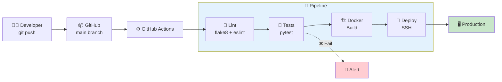

# 🔐 XAVFSIZLIK VA DEPLOY
### NafGroup CRM — Xavfsizlik · Server · CI/CD

---

## 🛡 1. XAVFSIZLIK ARXITEKTURASI

```mermaid
flowchart LR
    CL["🌐 Client"] -->|"1"| SSL["🔒 SSL/TLS"]
    SSL -->|"2"| CORS["🌐 CORS"]
    CORS -->|"3"| RATE["⏱ Rate Limit"]
    RATE -->|"4"| JWT["🔑 JWT Auth"]
    JWT -->|"5"| RBAC["👥 RBAC"]
    RBAC -->|"6"| VALID["✅ Validation"]
    VALID -->|"7"| AUDIT["📝 Audit Log"]
    AUDIT -->|"🔓"| API["⚙️ API"]

    style SSL fill:#C8E6C9,stroke:#2E7D32
    style JWT fill:#BBDEFB,stroke:#1565C0
    style RBAC fill:#FFE0B2,stroke:#E65100
    style AUDIT fill:#F3E5F5,stroke:#7B1FA2
```



### 1.1 Xavfsizlik choralari jadvali

| # | Chora | Qiymat | Tavsif |
|:-:|:------|:-------|:-------|
| 1 | 🔒 **HTTPS** | SSL majburiy | Let's Encrypt sertifikat |
| 2 | 🔑 **JWT** | Access: 15 daq | Refresh: 7 kun, RS256 |
| 3 | 🌐 **CORS** | Whitelist | Faqat ruxsat berilgan domenlar |
| 4 | ⏱ **Rate Limiting** | Login: 5/min | API: 100/min, Upload: 20/min |
| 5 | ✅ **Validation** | 2 qatlam | Zod (frontend) + DRF (backend) |
| 6 | 🔐 **Parol** | Min 8 belgi | Harf + raqam majburiy |
| 7 | 🚫 **Login block** | 5 urinish | 15 daqiqa bloklash |
| 8 | 📝 **Audit Log** | Barcha amallar | Kim, qachon, nima qildi |
| 9 | 📁 **File Check** | Tur + hajm | Ruxsat berilgan formatlar |
| 10 | 🔒 **SQL Injection** | ORM | Django ORM himoyasi |

---

## 🖥 2. SERVER TALABLARI

### 💻 Minimal (Development)

| Komponent | Tavsiya |
|:----------|:--------|
| OS | Ubuntu 22.04 LTS |
| CPU | 2 core |
| RAM | 4 GB |
| Disk | 40 GB SSD |
| Network | 50 Mbps |

### 🚀 Tavsiya etilgan (Production)

| Komponent | Tavsiya |
|:----------|:--------|
| OS | Ubuntu 22.04 LTS |
| CPU | 4+ core |
| RAM | 8+ GB |
| Disk | 100+ GB SSD |
| Network | 100+ Mbps |

---

## 🐳 3. DOCKER COMPOSE — PRODUCTION

```yaml
# docker-compose.prod.yml
version: '3.9'

services:
  # ──── DATA LAYER ────
  postgres:
    image: postgres:16-alpine
    restart: always
    volumes: [pgdata:/var/lib/postgresql/data]
    environment:
      POSTGRES_DB: ${DB_NAME}
      POSTGRES_USER: ${DB_USER}
      POSTGRES_PASSWORD: ${DB_PASSWORD}
    healthcheck:
      test: ["CMD-SHELL", "pg_isready -U ${DB_USER}"]

  redis:
    image: redis:7-alpine
    restart: always
    command: redis-server --requirepass ${REDIS_PASSWORD}

  minio:
    image: minio/minio:latest
    restart: always
    command: server /data --console-address ":9001"
    volumes: [minio_data:/data]

  # ──── APP LAYER ────
  django:
    build: { context: ., dockerfile: docker/Dockerfile }
    restart: always
    command: gunicorn config.wsgi --bind 0.0.0.0:8000 --workers 4
    depends_on: { postgres: { condition: service_healthy } }
    env_file: .env

  channels:
    build: { context: ., dockerfile: docker/Dockerfile }
    restart: always
    command: daphne config.asgi:application --bind 0.0.0.0 --port 8001

  celery:
    build: { context: ., dockerfile: docker/Dockerfile }
    restart: always
    command: celery -A config worker -l warning --concurrency=4

  celery-beat:
    build: { context: ., dockerfile: docker/Dockerfile }
    restart: always
    command: celery -A config beat -l warning

  telegram-bot:
    build: { context: ., dockerfile: docker/Dockerfile.bot }
    restart: always

  # ──── PROXY LAYER ────
  nginx:
    image: nginx:1.25-alpine
    restart: always
    ports: ["80:80", "443:443"]
    volumes:
      - ./docker/nginx/nginx.conf:/etc/nginx/nginx.conf
      - ./docker/nginx/ssl:/etc/nginx/ssl
      - static:/var/www/static
      - media:/var/www/media

volumes:
  pgdata:
  minio_data:
  static:
  media:
```

---

## 📡 4. NGINX KONFIGURATSIYA

```nginx
# HTTP → HTTPS redirect
server {
    listen 80;
    server_name crm.nafgroup.uz;
    return 301 https://$host$request_uri;
}

# Main server block
server {
    listen 443 ssl http2;
    server_name crm.nafgroup.uz;

    # SSL
    ssl_certificate     /etc/nginx/ssl/fullchain.pem;
    ssl_certificate_key /etc/nginx/ssl/privkey.pem;

    client_max_body_size 500M;  # Katta fayllar uchun

    # API → Django
    location /api/ {
        proxy_pass http://django:8000;
        proxy_set_header Host $host;
        proxy_set_header X-Real-IP $remote_addr;
        proxy_set_header X-Forwarded-Proto $scheme;
    }

    # WebSocket → Channels
    location /ws/ {
        proxy_pass http://channels:8001;
        proxy_http_version 1.1;
        proxy_set_header Upgrade $http_upgrade;
        proxy_set_header Connection "upgrade";
    }

    # Static & Media
    location /static/ { alias /var/www/static/; expires 30d; }
    location /media/  { alias /var/www/media/;  expires 7d;  }

    # Frontend SPA
    location / {
        root /var/www/frontend;
        try_files $uri /index.html;
    }
}
```

---

## 🔄 5. CI/CD PIPELINE



---

## 💾 6. BACKUP STRATEGIYASI

| # | Nima | Qancha tez | Saqlash | Usul |
|:-:|:-----|:----------:|:-------:|:-----|
| 1 | 🐘 PostgreSQL | Har kuni 03:00 | 30 kun | `pg_dump` → S3 |
| 2 | 📦 MinIO fayllar | Har kuni 04:00 | 90 kun | `rsync` → remote |
| 3 | 🔴 Redis | Har 6 soat | 7 kun | RDB snapshot |
| 4 | 🖥 Full server | Har hafta | 12 hafta | Server provider |

---

## 📊 7. MONITORING

| Vosita | Maqsad | Tavsif |
|:-------|:-------|:-------|
| 🔴 **Sentry** | Error tracking | Django + React xatolarni ushlash |
| 📊 **Prometheus** | Metrikalar | CPU, RAM, disk, HTTP stats |
| 📈 **Grafana** | Vizualizatsiya | Dashboard'lar |
| 🐳 **Docker HC** | Healthcheck | Servislar holati |
| 🌸 **Flower** | Celery monitor | Task holati va natija |
| 🐘 **pg_stat** | DB monitoring | Query performance |

---

## 🔧 8. ENVIRONMENT VARIABLES

```env
# ──── Database ────
DB_NAME=nafgroup_crm
DB_USER=nafgroup
DB_PASSWORD=<secure_password>
DB_HOST=postgres
DB_PORT=5432

# ──── Redis ────
REDIS_URL=redis://:password@redis:6379/0

# ──── Django ────
SECRET_KEY=<django_secret_key>
DEBUG=False
ALLOWED_HOSTS=crm.nafgroup.uz

# ──── JWT ────
JWT_ACCESS_LIFETIME=15         # daqiqa
JWT_REFRESH_LIFETIME=10080     # 7 kun

# ──── MinIO / S3 ────
AWS_S3_ENDPOINT_URL=http://minio:9000
AWS_ACCESS_KEY_ID=<minio_user>
AWS_SECRET_ACCESS_KEY=<minio_password>
AWS_STORAGE_BUCKET_NAME=nafgroup-files

# ──── Telegram Bot ────
TELEGRAM_BOT_TOKEN=<bot_token>
TELEGRAM_WEBHOOK_URL=https://crm.nafgroup.uz/api/v1/bot/webhook/

# ──── Email (optional) ────
EMAIL_HOST=smtp.gmail.com
EMAIL_PORT=587
EMAIL_HOST_USER=<email>
EMAIL_HOST_PASSWORD=<password>
```

---

*🔐 Xavfsizlik va deploy hujjati yakunlandi*
