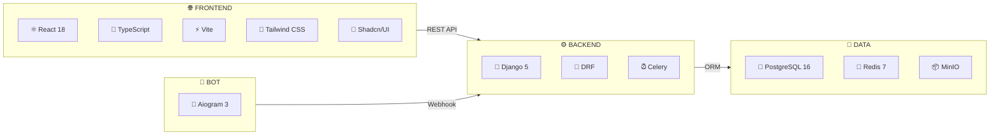
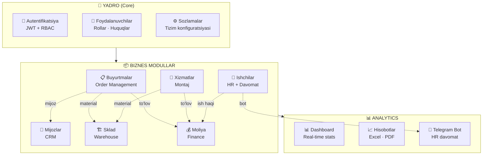
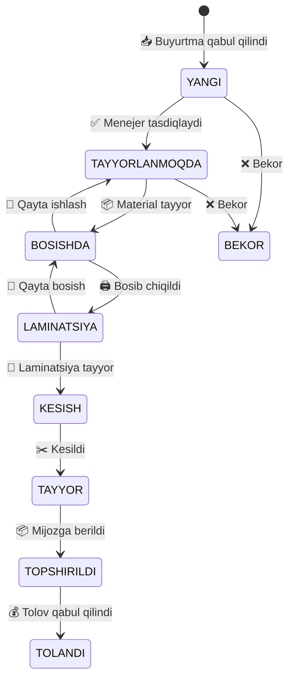
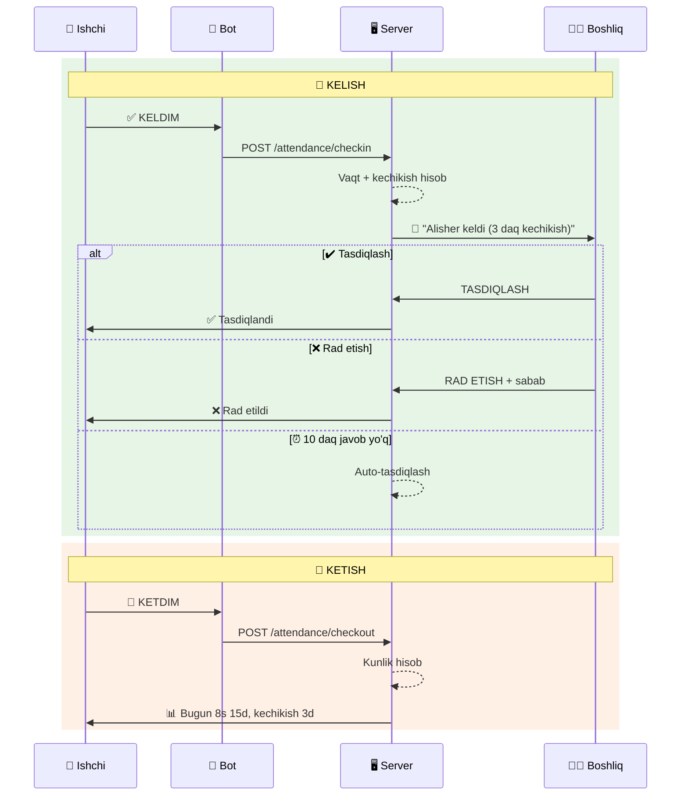
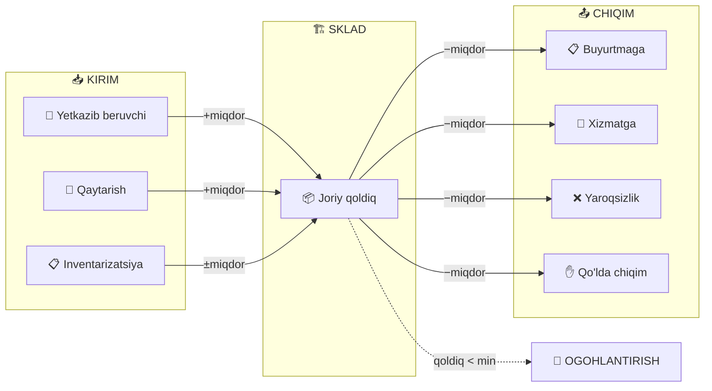
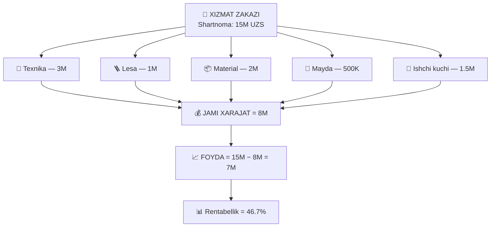
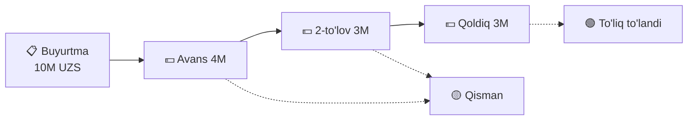
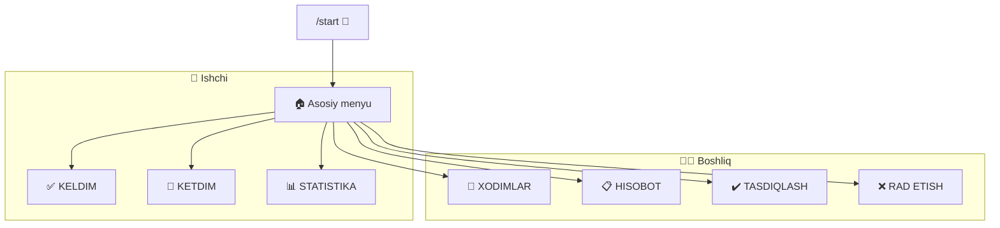
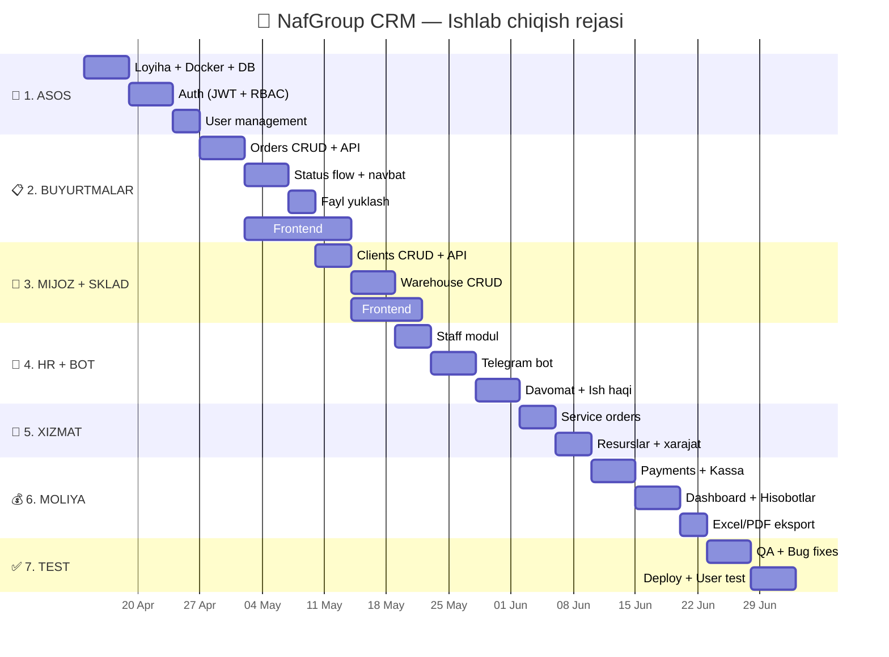

< | — |
| 2 | [Texnologiyalar steki](#-2-texnologiyalar-steki) | — |
| 3 | [Modullar tuzilishi](#-3-modullar-tuzilishi) | — |
| 4 | [Buyurtmalar moduli](#-4-diller-va-buyurtmalar) | — |
| 5 | [HR va Davomat moduli](#-5-ishchilar-hr-va-davomat) | — |
| 6 | [Sklad moduli](#-6-sklad-warehouse) | — |
| 7 | [Mijozlar CRM moduli](#-7-mijozlar-crm) | — |
| 8 | [Xizmatlar moduli](#-8-xizmatlar-va-montaj) | — |
| 9 | [Moliya moduli](#-9-moliyaviy-hisoblar) | — |
| 10 | [Dashboard](#-10-dashboard-va-analytics) | — |
| 11 | [Telegram Bot](#-11-telegram-hr-bot) | — |
| 12 | [Xavfsizlik](#-12-xavfsizlik) | — |
| 13 | [Ishlab chiqish rejasi](#-13-ishlab-chiqish-bosqichlari) | — |

</td></tr>
</table>

---

<br/>

## 🎯 1. LOYIHA HAQIDA UMUMIY MA'LUMOT

### 1.1 Maqsad

> Print va reklama korxonasining **barcha asosiy jarayonlarini** yagona CRM platformasiga birlashtirish va avtomatlashtirish.

<table>
<tr>
<td width="50%">

#### ✅ Tizim hal qiladigan muammolar

- 📦 Buyurtmalarni qo'lda boshqarish
- 👥 Ishchilar davomatini nazorat qilish
- 🏗 Sklad hisobini qo'lda yuritish
- 💰 Moliyaviy oqimlarni kuzatish
- 🔧 Xizmat ko'rsatish jarayonlarini tashkil etish
- 📊 Hisobotlarni qo'lda tayyorlash

</td>
<td width="50%">

#### 🚀 Tizim afzalliklari

- ⚡ Real-time buyurtmalar nazorati
- 🤖 Telegram orqali avtomatik davomat
- 📈 Avtomatik hisobotlar (Excel/PDF)
- 🔐 Rol-based huquqlar tizimi
- 📱 Responsive dizayn (mobil qo'llab-quvvatlash)
- 🔔 Ogohlantirish va bildirishnomalar

</td>
</tr>
</table>

### 1.2 Foydalanuvchilar

| Rol | 👤 Soni | Asosiy vazifalari | Kirish usuli |
|:----|:-------:|-------------------|:------------:|
| 👑 **Super Admin** | 1 | Barcha sozlamalar, foydalanuvchilar boshqaruvi | 🌐 Web |
| 📊 **Direktor** | 1–2 | Hisobotlar, monitoring, tasdiqlash | 🌐 Web |
| 📋 **Menejer** | 2–5 | Buyurtmalar, mijozlar, to'lovlar | 🌐 Web |
| ⚙️ **Operator** | 3–10 | Ishlab chiqarish, holat yangilash | 🌐 Web |
| 📦 **Sklad mudiri** | 1–2 | Materiallar kirim/chiqim | 🌐 Web |
| 💰 **Buxgalter** | 1–2 | Moliya, ish haqi, hisobotlar | 🌐 Web |
| 👷 **Ishchi** | 10–50 | Davomat, o'z statistikasi | 🤖 Telegram |

---

<br/>

## 🛠 2. TEXNOLOGIYALAR STEKI

### 2.1 Asosiy texnologiyalar



### 2.2 To'liq texnologiyalar jadvali

<table>
<tr>
<td width="50%">

#### 🌐 Frontend

| Texnologiya | Maqsad |
|:------------|:-------|
| React 18 + TypeScript | Asosiy freymvork |
| Vite | Build tool |
| Tailwind CSS | Styling |
| Shadcn/UI | UI komponentlar |
| Zustand | State management |
| React Hook Form + Zod | Formalar + validatsiya |
| TanStack Table | Jadvallar |
| Recharts | Grafiklar |
| React Dropzone | Fayl yuklash |
| Axios | HTTP client |
| React Router v6 | Navigatsiya |
| Sonner | Toast xabarlar |
| Lucide React | Ikonkalar |

</td>
<td width="50%">

#### ⚙️ Backend

| Texnologiya | Maqsad |
|:------------|:-------|
| Django 5 | Web framework |
| DRF (Django REST) | REST API |
| SimpleJWT | JWT autentifikatsiya |
| django-filter | Filtrlash |
| django-cors-headers | CORS |
| drf-spectacular | OpenAPI/Swagger |
| django-storages | S3/MinIO |
| Celery + Redis | Background tasks |
| Django Channels | WebSocket |
| openpyxl | Excel eksport |
| WeasyPrint | PDF eksport |
| Pillow | Rasm qayta ishlash |
| Aiogram 3.x | Telegram bot |

</td>
</tr>
</table>

---

<br/>

## 📦 3. MODULLAR TUZILISHI



> [!IMPORTANT]
> Har bir modul **mustaqil**, lekin bir-biri bilan **chuqur integratsiyalangan**. Buyurtma → Sklad → Moliya zanjiri avtomatik ishlaydi.

---

<br/>

## 📋 4. DILLER VA BUYURTMALAR

> **Eng muhim modul** — buyurtma qabul qilish, ishlab chiqarish jarayoni, yetkazib berish.

### 4.1 Fayl qabul qilish

<table>
<tr>
<td width="33%">

#### 🖼 Rasm formatlari
`.PNG` `.JPEG` `.TIFF` `.BMP`

</td>
<td width="33%">

#### ✏️ Vektor formatlari
`.AI` `.PSD` `.PDF` `.SVG`  
`.EPS` `.CDR` `.DXF`

</td>
<td width="33%">

#### 📦 Arxiv formatlari
`.ZIP` `.RAR`

**Max hajm:** 500 MB / fayl  
**Bir vaqtda:** 20 ta fayl

</td>
</tr>
</table>

### 4.2 Buyurtma kartochkasi

| # | Maydon | Turi | ✅ | Tavsif |
|:-:|--------|:----:|:--:|--------|
| 1 | 🔢 Buyurtma raqami | `Auto` | Avto | `ORD-20250402-001` format |
| 2 | 👤 Mijoz | `FK → Clients` | ✅ | Avto-complete qidiruv |
| 3 | 📐 Kenglik | `Float (sm)` | ✅ | Masalan: `300.5` |
| 4 | 📏 Balandlik | `Float (sm)` | ✅ | Masalan: `200.0` |
| 5 | 📏 O'lchov birligi | `Enum` | ✅ | `mm` · `sm` · `m` |
| 6 | 🔢 Miqdor | `Integer` | ✅ | Nechta bosiladi |
| 7 | 📦 Material turi | `FK → Products` | ✅ | Skladdan tanlash |
| 8 | 🖨 Bosma turi | `Enum` | ✅ | `1-tomon` · `2-tomon` |
| 9 | 📅 Topshiriq sanasi | `DateTime` | Avto | Hozirgi vaqt |
| 10 | ⏰ Deadline | `DateTime` | ✅ | Tayyor bo'lish sanasi |
| 11 | 🚨 Prioritet | `Enum` | ✅ | `Oddiy` · `Tezkor` · `Shoshilinch` |
| 12 | 💰 Narx | `Decimal` | ✅ | So'mda |
| 13 | 📝 Izoh | `TextField` | ❌ | Maxsus talablar |
| 14 | 📎 Fayllar | `FileField[]` | ✅ | Ko'p fayl yuklash |
| 15 | 📊 Holat | `Enum` | Avto | Status flow |

### 4.3 Buyurtma holatlari (Status Flow)



| Holat | Rang | Kim o'zgartiradi | Keyingi |
|:------|:----:|:----------------:|:-------:|
| `🟢 YANGI` | Yashil | Menejer | → TAYYORLANMOQDA |
| `🔵 TAYYORLANMOQDA` | Ko'k | Operator | → BOSISHDA |
| `🟡 BOSISHDA` | Sariq | Operator | → LAMINATSIYA |
| `🟠 LAMINATSIYA` | To'q sariq | Operator | → KESISH |
| `🟤 KESISH` | Jigarrang | Operator | → TAYYOR |
| `✅ TAYYOR` | Yashil | Ustaboshi | → TOPSHIRILDI |
| `📦 TOPSHIRILDI` | Kulrang | Menejer | → TO'LANDI |
| `💰 TO'LANDI` | Oltin | Buxgalter | ✔ Yakuniy |
| `🔴 BEKOR` | Qizil | Admin | ✔ Yakuniy |

### 4.4 Navbat va prioritet tizimi

> [!WARNING]
> Navbat tizimi ishlab chiqarishning to'g'ri ketishini ta'minlaydi.

| Prioritet | ⚖️ Vazn | 💰 Qo'shimcha narx | ⏰ Tezlik |
|:----------|:-------:|:------------------:|:---------:|
| 🟢 **Oddiy** | 1 | 0% | Standart |
| 🟡 **Tezkor** | 5 | +30% | 2× tez |
| 🔴 **Shoshilinch** | 10 | +50% | Juda tez |

**Qoidalar:**
1. ✅ Har bir buyurtma → avtomatik **navbat raqami**
2. ✅ Bir xil prioritet → **FIFO** (birinchi kelgan — birinchi)
3. 🔴 Shoshilinch → navbat **boshiga** o'tadi
4. 🔒 Operator faqat **birinchi** buyurtmaga o'tadi
5. 🔑 Navbat o'tkazish → **Admin tasdiqlashi** shart

### 4.5 Material avtomatik hisobi

```
📐 Sarflanadigan material = Kenglik × Balandlik × Miqdor × Koeffitsient

   Koeffitsient:
   ├── Standart bosma    = 1.0
   ├── Laminatsiya       = 1.15 (+15%)
   └── 2-tomonlama       = 2.0  (×2)
```

- ✅ Yetarli material → buyurtma yaratiladi
- ❌ Yetarli emas → 🔴 ogohlantirish chiqadi
- 📤 `BOSISHDA` holatida → operator tasdiqlaydi → skladdan ayiriladi

---

<br/>

## 👷 5. ISHCHILAR HR VA DAVOMAT

### 5.1 Ishchi kartochkasi

| # | Maydon | Turi | Tavsif |
|:-:|--------|:----:|--------|
| 1 | 👤 F.I.O | `CharField` | To'liq ism |
| 2 | 📱 Telefon | `CharField` | Aloqa raqami |
| 3 | 🤖 Telegram ID | `BigInt` | Unique |
| 4 | 💼 Lavozim | `FK → Position` | Bo'limga bog'liq |
| 5 | 🏢 Bo'lim | `FK → Department` | — |
| 6 | 📅 Yollanish sanasi | `DateField` | — |
| 7 | 💰 Maosh turi | `Enum` | `OYLIK` · `SOATBAY` · `KUNDUZGI` |
| 8 | 💵 Maosh miqdori | `Decimal` | So'mda |
| 9 | 🕐 Ish jadvali | `FK → Schedule` | Boshlanish/tugash vaqti |
| 10 | 📊 Holat | `Enum` | `FAOL` · `TA'TILDA` · `KASALLIK` · `BO'SHATILGAN` |

### 5.2 Davomat jarayoni



### 5.3 Ish haqi formulalari

<table>
<tr>
<td width="33%">

#### 💼 OYLIK rejim
```
Maosh = Oylik ÷ IshKunlari 
        × KelganKunlar
        − Jarimalar
        + Bonuslar
```

</td>
<td width="33%">

#### ⏰ SOATBAY rejim
```
Maosh = Stavka × JamiSoat
        − Jarimalar
        + Bonuslar
```

</td>
<td width="33%">

#### 📅 KUNDUZGI rejim
```
Maosh = KunlikStavka 
        × KelganKunlar
        − Jarimalar
        + Bonuslar
```

</td>
</tr>
</table>

| Ko'rsatkich | Formula |
|:------------|:--------|
| ⏰ Kechikish | `MAX(0, kelish − jadval_boshi)` daqiqalarda |
| 🚪 Erta ketish | `MAX(0, jadval_oxiri − ketish)` daqiqalarda |
| 📊 Kunlik soat | `ketish − kelish − tushlik` |
| 💸 Jarima | `FLOOR(kechikish ÷ 15) × jarima_stavka` |
| ⭐ Bonus | `ortiqcha_soat × bonus_stavka` |

---

<br/>

## 🏗 6. SKLAD (WAREHOUSE)

### 6.1 Mahsulot kartochkasi

| # | Maydon | Turi | Tavsif |
|:-:|--------|:----:|--------|
| 1 | 📦 Nomi | `CharField` | Masalan: Flex 3m laminatsiya |
| 2 | 🔖 SKU | `Auto/Manual` | Noyob tovar kodi |
| 3 | 📁 Kategoriya | `FK` | `Material` · `Uskuna` · `Sarf` · `Ehtiyot` |
| 4 | 📏 O'lchov birligi | `Enum` | `m²` · `dona` · `kg` · `metr` · `litr` · `rulon` |
| 5 | 📊 Joriy qoldiq | `Float` | Real-time qoldiq |
| 6 | ⚠️ Minimal qoldiq | `Float` | Ogohlantirish chegarasi |
| 7 | 💰 Tan narx | `Decimal` | Kirim narxi |
| 8 | 💵 Sotish narxi | `Decimal` | — |
| 9 | 🚚 Yetkazib beruvchi | `FK` | Supplier |
| 10 | 📍 Joylashuv | `CharField` | Masalan: A-2 regal |

### 6.2 Kirim/Chiqim oqimi



---

<br/>

## 👥 7. MIJOZLAR (CRM)

### 7.1 Mijoz toifalari

| Toifa | Belgi | Tavsif |
|:------|:-----:|:-------|
| 🥇 **VIP** | Oltin | Katta hajm, doimiy |
| 🔵 **Doimiy** | Ko'k | Muntazam buyurtma |
| 🟢 **Yangi** | Yashil | Birinchi murojaat |
| 🔴 **Muammoli** | Qizil | Qarz, muammolar |

### 7.2 Mijoz profili

```
┌───────────────────────────────────────────────────────────┐
│  👤 ALISHER KARIMOV                          🥇 VIP      │
│  📱 +998 90 123-45-67  ·  ✉️ alisher@mail.uz             │
├───────────────────────────────────────────────────────────┤
│                                                           │
│  ┌──────────┐ ┌──────────┐ ┌──────────┐ ┌──────────┐    │
│  │ 📋 Jami  │ │ ✅ To'lan │ │ 🔴 Qarz  │ │ 📈 Foyda │    │
│  │  45.2M   │ │  38.1M   │ │  7.1M    │ │  12.3M   │    │
│  └──────────┘ └──────────┘ └──────────┘ └──────────┘    │
│                                                           │
│  ┌──────┬──────────┬─────────┬──────────┐                │
│  │ INFO │ BUYURTMA │ TO'LOV  │ IZOHLAR  │ ← tablar      │
│  └──────┴──────────┴─────────┴──────────┘                │
└───────────────────────────────────────────────────────────┘
```

### 7.3 Moliyaviy hisob

| Ko'rsatkich | Formula |
|:------------|:--------|
| 📋 Jami summasi | `SUM(orders.price)` |
| ✅ To'langan | `SUM(payments.amount)` |
| 🔴 Qarz | `Jami − To'langan` |
| 📦 Tan narxi | `SUM(material.cost)` |
| 📈 Foyda | `Narx − Tan narx` |
| 📊 Marjinallik | `(Foyda ÷ Narx) × 100%` |

---

<br/>

## 🔧 8. XIZMATLAR VA MONTAJ

### 8.1 Xizmat turlari

| Tur | Emoji | Tavsif |
|:----|:-----:|:-------|
| O'rnatish | 🏗 | Yangi reklama o'rnatish |
| Ko'chirish | 🚚 | Bir joydan boshqasiga |
| Demontaj | 🔨 | Olib tashlash |
| Ta'mirlash | 🔧 | Mavjud reklama ta'miri |

### 8.2 Resurslar va xarajat hisob



---

<br/>

## 💰 9. MOLIYAVIY HISOBLAR

### 9.1 To'lov usullari

| Usul | Belgi |
|:-----|:-----:|
| Naqd | 💵 |
| Bank o'tkazmasi | 🏦 |
| Karta | 💳 |
| Payme | 📱 |
| Click | 📱 |
| Uzum | 📱 |

### 9.2 Qisman to'lov



### 9.3 Hisobotlar

| Hisobot | Davriylik | Format |
|:--------|:---------:|:------:|
| 📊 Kunlik kassa | Har kuni | Excel · PDF |
| 📈 Haftalik daromad | Har hafta | Excel · PDF |
| 💰 Oylik P&L | Har oy | Excel · PDF |
| 🔴 Debitorlik qarzlar | Real-time | Excel |
| 📉 Xarajatlar tuzilmasi | Har oy | Excel · PDF |

---

<br/>

## 📊 10. DASHBOARD VA ANALYTICS

### 10.1 Widgetlar

```
┌─────────────────────────────────────────────────────────────────┐
│  📊 BOSHQARUV PANELI                                    ⚙️ 👤  │
├─────────────┬──────────────┬──────────────┬────────────────────┤
│  📋 BUGUNGI  │  ⚡ FAOL      │  🚨 SHOSHILINCH│  💰 DAROMAD     │
│  12 buyurtma │  28 ta       │  3 ta        │  8.5M UZS        │
│  +15.2M UZS  │  jarayonda   │  ⏰ deadline   │  ▲ +12%          │
├─────────────┴──────────────┴──────────────┴────────────────────┤
│  📈 Oylik daromad trendi          │  🔔 Sklad ogohlantirishlari │
│  ████████▓▓▓▓░░░░░░░              │  ⚠️ Flex 3m — 15m² qoldi  │
│  ████████████▓▓▓░░░               │  ⚠️ Oracal — 5 rulon      │
│  ████████████████▓                │  🔴 Lamnat — TUGADI!       │
├───────────────────────────────────┼─────────────────────────────┤
│  👷 Ishchilar holati              │  📋 Buyurtmalar navbati     │
│  ✅ Ish joyida: 12               │  YANGI(5) → TAYYOR(3)      │
│  ❌ Kelmagan: 3                  │  → BOSISHDA(8)             │
│  🕐 Kechikkan: 2                │  → LAMINATSIYA(4)          │
└───────────────────────────────────┴─────────────────────────────┘
```

### 10.2 RBAC — Huquqlar matritsasi

| Modul | 👑 SA | 📊 Dir | 📋 Men | ⚙️ Opr | 📦 Skl | 💰 Bux | 👷 Ish |
|:------|:-----:|:------:|:------:|:------:|:------:|:------:|:------:|
| **Buyurtmalar** | ✅ CRUD | 👁 R | ✏️ CRUD | 🔄 Status | — | 👁 R | — |
| **Mijozlar** | ✅ CRUD | 👁 R | ✏️ CRUD | — | — | — | — |
| **Sklad** | ✅ CRUD | 👁 R | 👁 R | 📝 RW | ✏️ CRUD | — | — |
| **HR** | ✅ CRUD | 👁 R | 👁 R | — | — | 👁 R | 🤖 Bot |
| **Xizmatlar** | ✅ CRUD | 👁✔️ R+A | ✏️ CRUD | — | — | — | — |
| **Moliya** | ✅ CRUD | 👁 R | 📝 W | — | — | ✏️ CRUD | — |
| **Dashboard** | 🌟 Full | 🌟 Full | 📊 Ltd | 📊 Ltd | 📊 Ltd | 📊 Ltd | — |
| **Sozlamalar** | ✅ Full | — | — | — | — | — | — |

---

<br/>

## 🤖 11. TELEGRAM HR BOT

### 11.1 Bot menyu tuzilishi



### 11.2 Xabar namunalari

<table>
<tr>
<td width="50%">

#### 📩 Boshliqqa xabar
```
📍 Yangi kelish xabarnomasi

👤 Ishchi: Alisher Karimov
🏢 Bo'lim: Ishlab chiqarish
🕐 Vaqt: 09:23
⏰ Kechikish: 3 daqiqa
📅 Sana: 2025-04-02

[✔️ TASDIQLASH] [❌ RAD ETISH]
```

</td>
<td width="50%">

#### 📊 Ishchi statistikasi
```
📊 Oylik statistika — Mart 2025

👤 Alisher Karimov

📅 Ish kunlari: 22
✅ Kelgan: 20 | ❌ Kelmagan: 2
⏰ Kechikishlar: 5 (47 daq)
🕐 Jami soat: 168

💰 Maosh: 4,200,000 UZS
📉 Jarima: −150,000
💵 JAMI: 4,050,000 UZS
```

</td>
</tr>
</table>

---

<br/>

## 🔐 12. XAVFSIZLIK

| Chora | Tavsif |
|:------|:-------|
| 🔑 **JWT** | Access: 15 daq, Refresh: 7 kun |
| 🔒 **HTTPS** | SSL majburiy (Let's Encrypt) |
| 🌐 **CORS** | Faqat ruxsat berilgan domenlar |
| ⏱ **Rate Limit** | Login: 5/min, API: 100/min |
| ✅ **Validation** | Zod (frontend) + DRF (backend) |
| 🔐 **Parol** | Min 8 belgi, harf + raqam |
| 📝 **Audit Log** | Barcha muhim amallar loglanadi |
| 📁 **File Check** | Fayl turi va hajmi tekshiriladi |

---

<br/>

## 📅 13. ISHLAB CHIQISH BOSQICHLARI



| # | Bosqich | Muddat | Tarkib |
|:-:|:--------|:------:|:-------|
| 1 | 📐 **Asos** | 2 hafta | Docker, DB, Auth, RBAC |
| 2 | 📋 **Buyurtmalar** | 3 hafta | Orders, Status, Files, UI |
| 3 | 👥 **Mijoz + Sklad** | 2 hafta | Clients, Warehouse, UI |
| 4 | 👷 **HR + Bot** | 2 hafta | Staff, Telegram, Davomat |
| 5 | 🔧 **Xizmatlar** | 1.5 hafta | Services, Resurslar |
| 6 | 💰 **Moliya** | 2 hafta | Payments, Dashboard, Export |
| 7 | ✅ **Test** | 1.5 hafta | QA, Deploy, User test |
| | | **~14 hafta** | **Jami: ~3.5 oy** |

---

<br/>

## 🔮 QO'SHIMCHA IMKONIYATLAR (2-bosqich)

| # | Imkoniyat | Prioritet |
|:-:|:----------|:---------:|
| 1 | 📩 Mijozga avtomatik xabar (buyurtma tayyor) | 🔴 Yuqori |
| 2 | 📊 KPI tizimi — operator samaradorligi | 🔴 Yuqori |
| 3 | 📱 Telegram orqali yangi buyurtma | 🔴 Yuqori |
| 4 | 📱 Mobil ilova (PWA) | 🟡 O'rta |
| 5 | 🏢 Ko'p filial boshqaruvi | 🟡 O'rta |
| 6 | 📨 SMS xabar (Eskiz/Playmobile) | 🟡 O'rta |
| 7 | 🔗 1C integratsiya | 🟡 O'rta |
| 8 | 📷 Buyurtma QR kodi | 🟢 Past |
| 9 | 📊 Google Sheets eksport | 🟢 Past |
| 10 | 🤖 AI — buyurtma vaqtini bashorat | 🟢 Past |

---

<div align="center">

**📋 Hujjat yakunlandi**

*Barcha savollar bo'yicha loyiha rahbari bilan muzokaralar olib boriladi.*

`NafGroup CRM` · `v2.0` · `2025`

</div>
]]>
