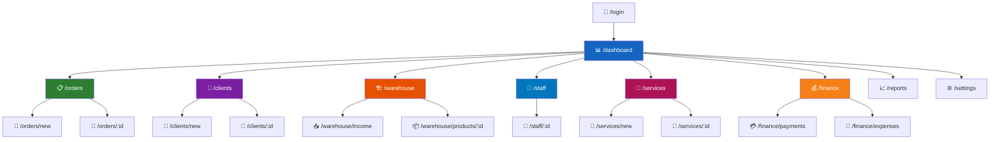

# 🎨 UI/UX DIZAYN
### NafGroup CRM — Interfeys Loyihalash

---

## 🗺 1. SAHIFALAR XARITASI



---

## 📐 2. LAYOUT TUZILISHI

```text
┌──────────────────────────────────────────────────────────────┐
│  🔝 HEADER BAR                                              │
│  ┌───────┬───────────────────────────────┬────────────────┐  │
│  │ 🏭    │  🔍 Global Search...          │  🔔  🌗  👤   │  │
│  │ Logo  │                               │  Notif Theme  │  │
│  └───────┴───────────────────────────────┴────────────────┘  │
├────────┬─────────────────────────────────────────────────────┤
│ 📱     │  MAIN CONTENT AREA                                  │
│ SIDEBAR│                                                     │
│        │  ┌─ Page Header ──────────────────────────────────┐ │
│ 📊 Dash│  │  📋 Buyurtmalar        [+ Yangi]  [📥 Export] │ │
│ 📋 Ord │  └───────────────────────────────────────────────┘ │
│ 👥 Cli │                                                     │
│ 🏗 Skl │  ┌─ Filters ─────────────────────────────────────┐ │
│ 👷 Stf │  │ Holat ▼    Prioritet ▼    Sana ▼    🔍 Qidir  │ │
│ 🔧 Svc │  └───────────────────────────────────────────────┘ │
│ 💰 Fin │                                                     │
│ 📈 Rep │  ┌─ Data Table / Kanban ─────────────────────────┐ │
│ ⚙️ Set │  │                                               │ │
│        │  │  Sortable · Filterable · Paginated             │ │
│ ────── │  │                                               │ │
│ 🚪 Out │  └───────────────────────────────────────────────┘ │
└────────┴─────────────────────────────────────────────────────┘
```

---

## 🎨 3. DIZAYN TIZIMI

### 3.1 Ranglar palitra

#### 🌞 Light Mode

| Rang | Hex | Ishlatilish |
|:-----|:----|:------------|
| 🔵 Primary | `#1E3A5F` | Tugmalar, sidebar |
| 🔵 Primary Light | `#2D5F8A` | Hover |
| ⬛ Primary Dark | `#0F2440` | Header |
| ⬜ Background | `#F8FAFC` | Sahifa foni |
| ⬜ Card | `#FFFFFF` | Kartochkalar |
| ⬛ Text | `#1E293B` | Asosiy matn |
| 🔘 Text Muted | `#64748B` | Ikkilamchi |
| ⬜ Border | `#E2E8F0` | Chegaralar |

#### 🌙 Dark Mode *(2-bosqich)*

| Rang | Hex | Ishlatilish |
|:-----|:----|:------------|
| 🔵 Primary | `#60A5FA` | Tugmalar |
| 🔵 Primary Light | `#93C5FD` | Hover |
| ⬛ Background | `#0F172A` | Sahifa foni |
| ⬛ Card | `#1E293B` | Kartochkalar |
| ⬜ Text | `#F1F5F9` | Asosiy matn |
| 🔘 Text Muted | `#94A3B8` | Ikkilamchi |
| ⬛ Border | `#334155` | Chegaralar |

#### Status ranglari

| Holat | Rang | Hex |
|:------|:----:|:----|
| 🟢 Muvaffaqiyat / Tayyor | Yashil | `#10B981` |
| 🟡 Ogohlantirish / Jarayonda | Sariq | `#F59E0B` |
| 🔴 Xato / Bekor | Qizil | `#EF4444` |
| 🔵 Ma'lumot / Yangi | Ko'k | `#3B82F6` |
| 🟣 Maxsus / VIP | Binafsha | `#8B5CF6` |

### 3.2 Tipografiya

| Element | Font | Hajm | Vazn |
|:--------|:-----|:----:|:----:|
| **H1** — Sahifa sarlavhasi | Inter | 28px | Bold (700) |
| **H2** — Bo'lim sarlavhasi | Inter | 24px | SemiBold (600) |
| **H3** — Karta sarlavhasi | Inter | 20px | SemiBold (600) |
| **Body** — Asosiy matn | Inter | 14px | Regular (400) |
| **Small** — Yordamchi matn | Inter | 12px | Regular (400) |
| **Button** — Tugma matni | Inter | 14px | Medium (500) |
| **Badge** — Status belgi | Inter | 12px | Medium (500) |

### 3.3 Komponentlar kutubxonasi

| Komponent | Variantlar |
|:----------|:-----------|
| 🔘 **Button** | Primary · Secondary · Outline · Ghost · Danger |
| 📝 **Input** | Text · Number · Select · DatePicker · Search · TextArea |
| 📊 **Table** | Sortable · Filterable · Paginated · Selectable |
| 📋 **Card** | Stats · Info · Action · Profile |
| 🏷 **Badge** | Status (rangli) · Priority · Category |
| 💬 **Modal** | Confirm · Form · Detail · Delete |
| 🔔 **Toast** | Success · Error · Warning · Info |
| 📂 **Sidebar** | Collapsible · Active state · Icons · Submenu |
| 📎 **FileUpload** | Drag & Drop · Preview · Progress bar |
| 📊 **Kanban** | Draggable columns · Status-based |
| 📈 **Chart** | Line · Bar · Pie · Area (Recharts) |
| 📅 **Calendar** | Month view · Davomat uchun |

---

## 📱 4. RESPONSIVE

| Breakpoint | Hajm | Layout |
|:-----------|:----:|:-------|
| 🖥 **Desktop** | ≥1280px | Sidebar (240px) + Content |
| 📱 **Tablet** | 768–1279px | Collapsed sidebar (60px) + Content |
| 📱 **Mobile** | <768px | Bottom navigation + Full content |

---

## ✨ 5. ANIMATSIYALAR

| Element | Animatsiya | Davomiyligi |
|:--------|:-----------|:----------:|
| 📄 Page transition | Fade in | 200ms |
| 💬 Modal | Scale + Fade | 150ms |
| 📂 Sidebar toggle | Slide | 200ms |
| 🔔 Toast | Slide from top | 300ms |
| 📊 Kanban drag | Smooth + Shadow | realtime |
| 🔘 Button hover | Scale 1.02 + Shadow | 150ms |
| 📊 Table row hover | Background highlight | 100ms |
| 🔢 Stats card | Count up | 800ms |
| 📈 Charts | Draw on load | 1000ms |

---

## 📄 6. ASOSIY SAHIFALAR

| # | Sahifa | URL | Asosiy elementlar |
|:-:|:-------|:----|:------------------|
| 1 | 📊 Dashboard | `/dashboard` | Stats cards · Grafik · Kanban · Alerts |
| 2 | 📋 Buyurtmalar | `/orders` | Table/Kanban · Filters · Status badges |
| 3 | 📝 Yangi buyurtma | `/orders/new` | Form · File upload · Material select |
| 4 | 📄 Buyurtma detail | `/orders/:id` | Tabs: Info · Files · History · Payments |
| 5 | 👥 Mijozlar | `/clients` | Table · Category badges · Search |
| 6 | 📄 Mijoz profili | `/clients/:id` | Stats cards · Tabs: Info · Orders · Payments |
| 7 | 🏗 Sklad | `/warehouse` | Table · Low stock alerts · Stats |
| 8 | 📥 Sklad kirim | `/warehouse/income` | Form · Product search · Document upload |
| 9 | 👷 Ishchilar | `/staff` | Table · Status badges · Department filter |
| 10 | 📄 Ishchi profili | `/staff/:id` | Calendar (davomat) · Salary report |
| 11 | 🔧 Xizmatlar | `/services` | Table · Status · Resource manager |
| 12 | 💰 Moliya | `/finance` | Payment form · CashFlow chart · Reports |
| 13 | 📈 Hisobotlar | `/reports` | Report selector · Date range · Export |
| 14 | ⚙️ Sozlamalar | `/settings` | Tabs: General · Users · Schedules · Penalties |

---

*🎨 UI/UX dizayn hujjati yakunlandi*
