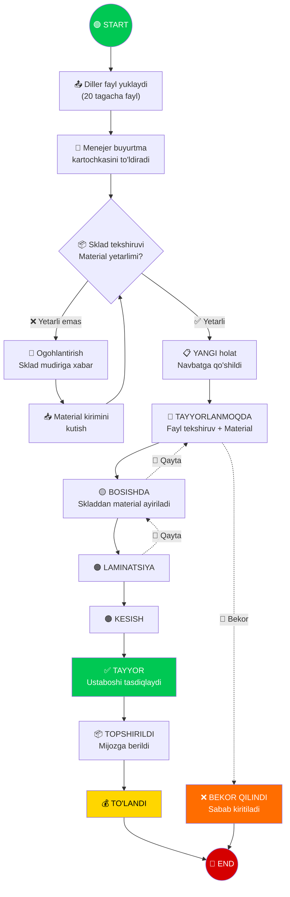
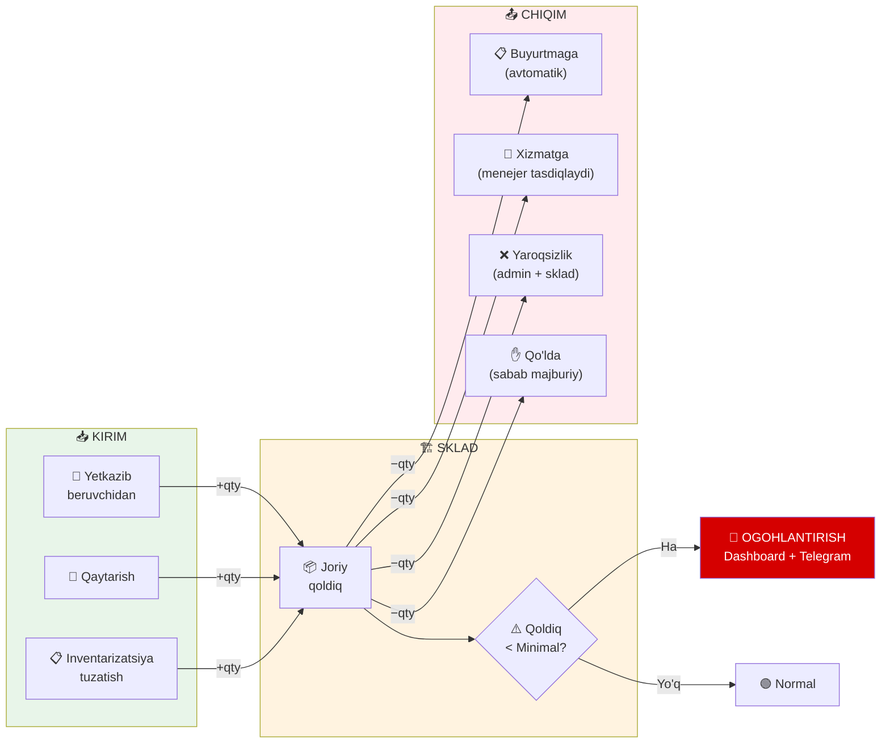
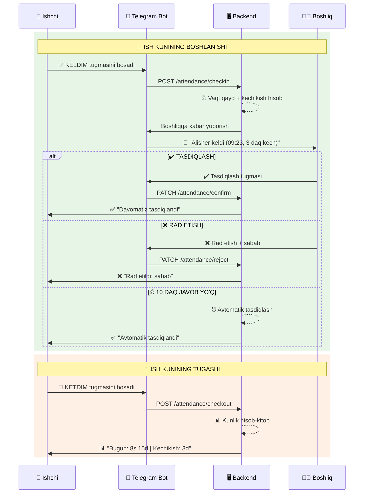
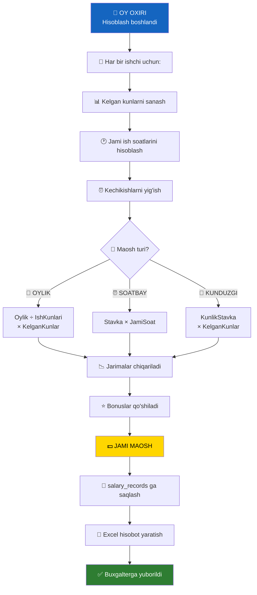
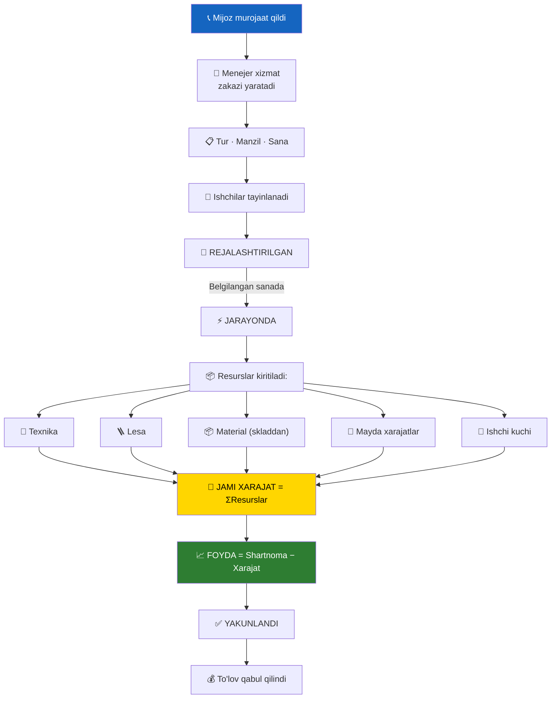
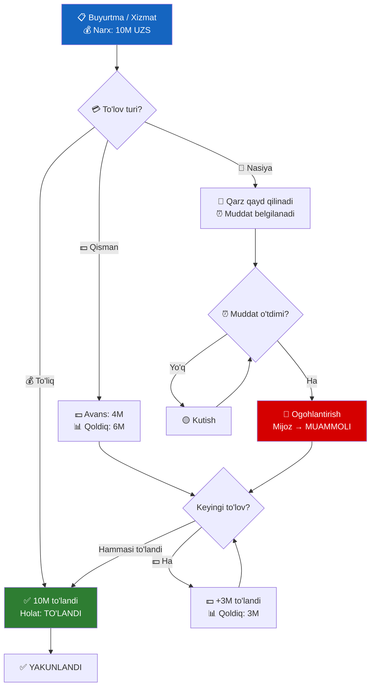
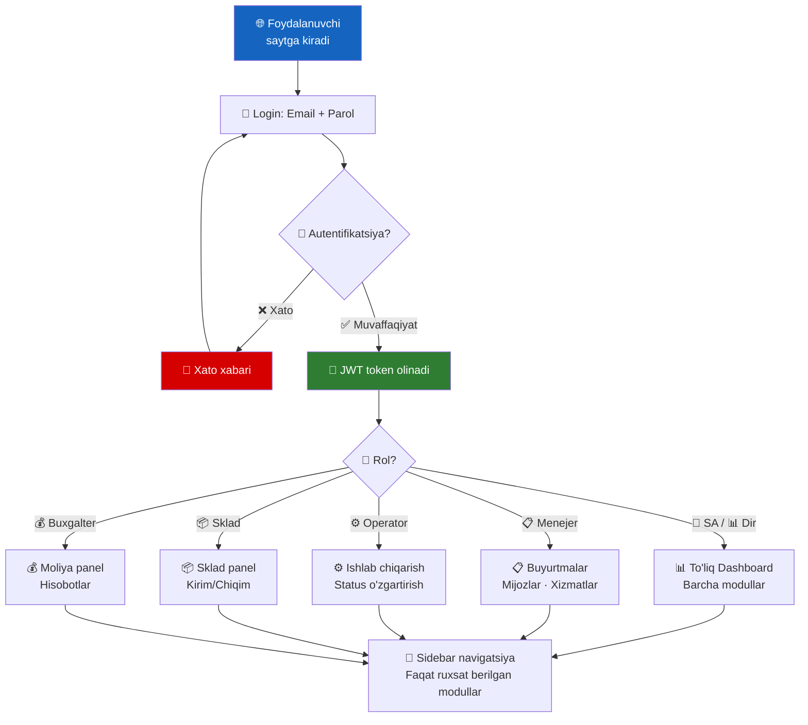

<![CDATA[

# 🔄 WORKFLOW DIAGRAMMALARI

### NafGroup CRM — Biznes Jarayonlar Oqimi

---

 

## 📋 1. BUYURTMA — TO'LIQ HAYOT SIKLI

---

 

## 🏗 2. SKLAD KIRIM-CHIQIM

---

 

## 👷 3. HR DAVOMAT — TO'LIQ JARAYON

---

 

## 💰 4. OYLIK ISH HAQI HISOBLASH

---

 

## 🔧 5. XIZMAT ZAKAZI JARAYONI

---

 

## 💳 6. TO'LOV VA QARZ BOSHQARUVI

---

 

## 🔐 7. LOGIN VA NAVIGATSIYA

---

*🔄 Workflow diagrammalari yakunlandi*

]]>
